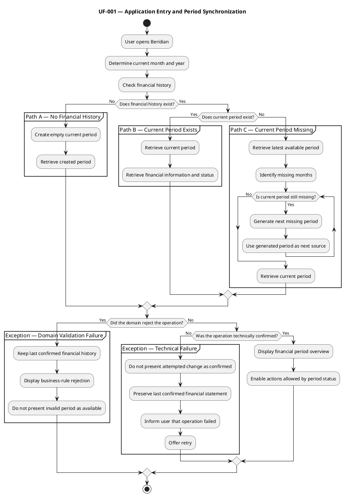

# UF-001 — Application Entry and Period Synchronization

## Purpose

Ensure that the user reaches the financial period corresponding to the current month without performing unnecessary initialization or synchronization tasks.

## Participating Scenarios

- SC-001 — First Access Without Financial History.
- SC-002 — Access With a Current Financial Period.
- SC-003 — Access With History but No Current Financial Period.
- SC-004 — Financial Period Overview.

## Entry Condition

The user opens Beridian.

## Scheduled Generation Context

The current financial period is normally created by the scheduled monthly generation process defined in UF-004.

UF-001 verifies that the current financial period exists when the user opens Beridian. If it is missing, Path C restores continuity as a recovery mechanism.

## Main Flow

1. Beridian determines the current month and year.
2. The system verifies whether financial history exists.
3. The system follows one of three paths.

## Operation Paths

### Path A — No Financial History Exists

1. The system creates an empty financial period for the current month.
2. The generated period remains open.
3. The system retrieves the created period.
4. The system displays the financial period overview.

This path corresponds to SC-001.

### Path B — The Current Financial Period Exists

1. The system retrieves the period corresponding to the current month.
2. The system retrieves its financial information and status.
3. The system displays the financial period overview.
4. If the period is closed, only consultation operations are available.

This path corresponds to SC-002.

### Path C — History Exists but the Current Period Is Missing

1. The system retrieves the latest available financial period.
2. The system identifies the missing months between that period and the current month.
3. The system generates each missing period in chronological order.
4. Each generated period becomes the source for the following missing month.
5. The system continues until the current financial period exists.
6. The system retrieves and displays the current financial period overview.

This path corresponds to SC-003.

## Exception Flows

### Exception Flow — Domain Validation Failure

1. The application submits a structurally valid initialization or period-generation operation.
2. The domain evaluates the applicable business rules and financial period state.
3. The domain rejects the operation.
4. The financial history remains in its last confirmed state.
5. Beridian communicates why the operation could not be completed.
6. The system does not present an incomplete or invalid financial period as available.

Possible causes include:

- A financial period already exists for the target month and year.
- A required period-generation condition is not satisfied.
- Another financial period business rule prevents the operation.

### Exception Flow — Technical Failure

1. A potentially valid operation cannot be completed or confirmed because of a technical failure.
2. Beridian does not present the attempted change as confirmed.
3. The application preserves the last confirmed financial statement.
4. The system informs the user that the operation could not be completed.
5. The user may retry the operation.

Possible causes include:

- API unavailability.
- Network failure.
- Request timeout.
- Database or persistence failure.
- An unexpected server error.

When that information is available, Beridian identifies the initialization, retrieval, or generation operation that failed.

## Final State

- A financial period exists for the current month.
- The current financial period is displayed.
- Its open or closed status is visible.
- Only operations allowed by its status are available.
- Historical and other open periods remain unchanged.
- The user reaches the financial period without manually creating missing periods.

## PlantUML Activity Diagram

