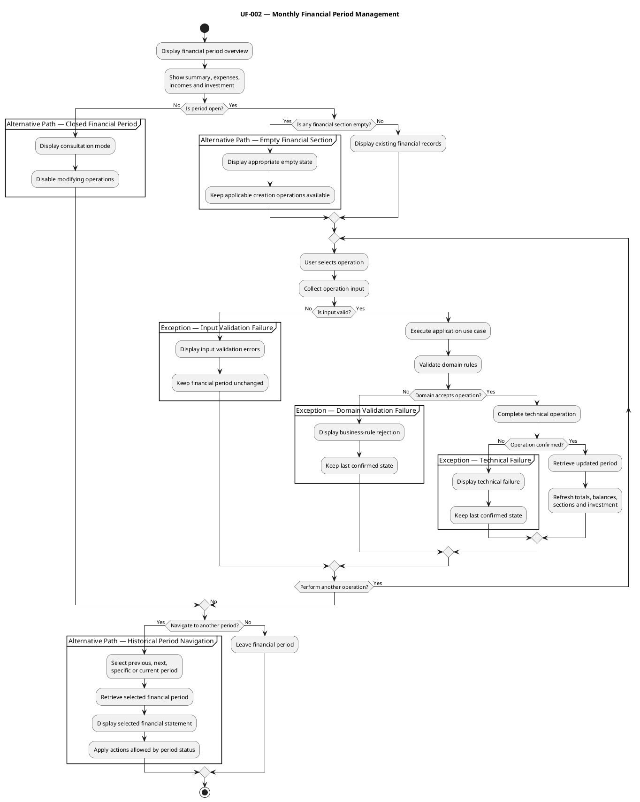

# UF-002 — Monthly Financial Period Management

## Purpose

Allow the user to review and update the incomes, expenses, investment, and balances of an open financial period from a unified monthly financial statement.

## Participating Scenarios
- SC-004 — Financial Period Overview.
- SC-005 — Income Management Flow.
- SC-006 — Expense Management Flow.
- SC-007 — Investment and Balance Flow.

## Entry Condition

The user is viewing a financial period overview.

## Main Flow
1. Beridian displays the financial summary.
2. The system displays:
   - Expenses on the left.
   - Incomes on the right.
   - Investment below both sections.
   - Planned and actual balances in the summary.
3. The system verifies the financial period status.
4. If the period is open, the user selects an available financial operation.
5. The system executes the corresponding income, expense, or investment flow.
6. After a successful operation, the system retrieves the updated financial period.
7. The system refreshes:
   - Planned and actual totals.
   - Planned and actual balances.
   - Income information.
   - Expense information.
   - Investment information.
8. The updated financial statement remains visible.
9. The user can perform another operation or leave the period.

## Operation Paths
### Path A — Income Management

The user can perform an income operation supported by the application:

 - Add a planned income.
 - Enter the actual amount of an existing income.

After successful completion:

 1. The income section is refreshed.
 2. Income totals are recalculated.
 3. Actual or planned balances are refreshed.
 4. Investment information is refreshed when affected by the domain calculations.

This path corresponds to **SC-005**.

### Path B — Expense Management

The user can perform an expense operation supported by the application:

 - Add a discretionary expense.
 - Add a fixed-term expense.
 - Select an expense containing details.
 - Enter an expense using its details.
 - Perform other expense-entry operations when supported by the backend.

When an expense contains details:

 1. The user selects the expense.
 2. Beridian opens the expense-detail popup.
 3. The user reviews or enters the details allowed by the period and expense state.
 4. The actual expense amount is obtained from the sum of its details.
 5. The popup and financial statement are refreshed.

After successful completion:

 1. The expense section is refreshed.
 2. Expense totals are recalculated.
 3. Balances are refreshed.
 4. Actual investment is refreshed when affected by an unexpected expense.

This path corresponds to **SC-006**.

### Path C — Investment Management

The user reviews:

 - Planned investment.
 - Actual investment.
 - Planned remaining balance.
 - Actual remaining balance.

When supported by the application, the user can enter or modify the actual investment amount.

After successful completion:

 - The investment section is refreshed.
 - The actual remaining balance is refreshed.
 - The updated financial statement remains visible.

This path corresponds to **SC-007**.

## Alternative Paths

### Alternative Path — Closed Financial Period
 1. The system identifies that the financial period is closed.
 2. The complete financial statement remains visible.
 3. Existing expense details remain available for consultation.
 4. Income, expense, and investment modification operations are unavailable.
 5. The user can leave the period or navigate to another one.
  
### Alternative Path — Empty Financial Section
 1. The system detects that an income, expense, or investment section has no records.
 2. The system displays an appropriate empty state.
 3. The absence of records is not presented as an error.
 4. If the period is open, applicable creation operations remain available.

### Alternative Path — Historical Financial Period Navigation

1. The user uses the financial period navigation bar.
2. The user chooses one of the available navigation options:
   - Previous financial period.
   - Next financial period.
   - Specific month and year.
   - Current financial period.
3. Beridian requests the selected financial period.
4. The system displays the selected financial statement.
5. The displayed month, year, and status are updated.
6. Operations are enabled or disabled according to the selected period state.
7. No financial period is modified by the navigation operation.

## Exception Flows

### Exception Flow — Input Validation Failure

 1. The user submits incomplete or incorrectly formatted information.
 2. The presentation or application validation rejects the input.
 3. Beridian identifies the fields that must be corrected.
 4. No use case is executed.
 5. The financial period remains unchanged.
 6. The user may correct the information and retry.

Possible causes include:

 - A required field is missing.
 - A monetary value has an invalid format.
 - A date has an invalid format.
 - The submitted value cannot be converted to the required data type.

### Exception Flow — Domain Validation Failure

1. The application submits a structurally valid operation.
2. The domain evaluates the applicable business rules and entity state.
3. The domain rejects the operation.
4. The financial period remains unchanged.
5. Beridian communicates why the operation could not be completed.
6. The user returns to the financial period overview.

Possible causes include:

- An attempt to modify a closed financial period.
- An operation that is incompatible with the current entity state.
- An expense operation violates a rule associated with its type.
- An entity does not belong to the selected financial period.
- Another financial period business rule is violated.

### Exception Flow — Technical Failure

 1. A potentially valid operation cannot be completed or confirmed because of a technical failure.
 2. Beridian does not present the attempted change as confirmed.
 3. The application preserves the last confirmed financial statement.
 4. The system informs the user that the operation could not be completed.
 5. The user may retry the operation.

Possible causes include:

- API unavailability.
- Network failure.
- Request timeout.
- Database or persistence failure.
- An unexpected server error.

## Final State
 - The financial statement reflects the latest confirmed state.
 - Planned and actual amounts remain independently visible.
 - Financial totals, balances, and investment are consistent with successful operations.
 - The user remains within the financial period overview.
 - No modification is applied to a closed period.

## PlantUML Activity Diagram

