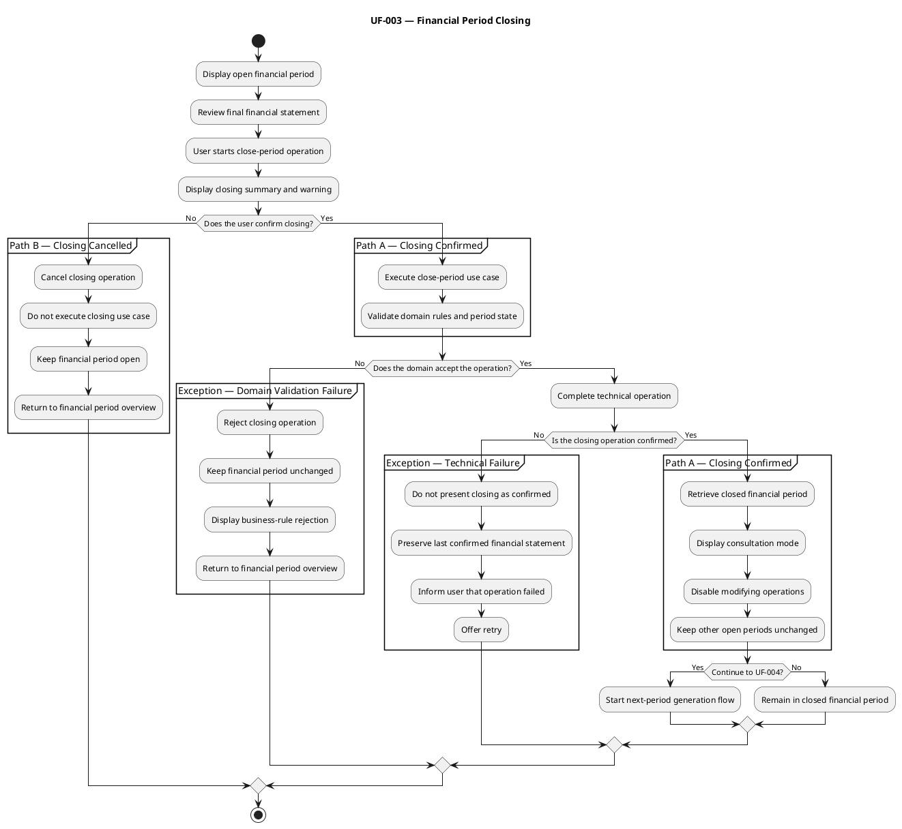

# UF-003 — Financial Period Closing
## Purpose

Allow the user to review and manually close an open financial period while preserving its final financial statement for consultation.

## Participating Scenarios
 - SC-004 — Financial Period Overview.
 - SC-008 — Financial Period Closing Flow.
 - SC-009 — Next Financial Period Generation Flow, as a possible subsequent flow.

## Entry Condition

The user is viewing an open financial period and decides to close it.

## Main Flow
 1. Beridian displays the financial period overview.
 2. The user reviews:
    - Planned and actual balances.
    - Planned and actual incomes.
    - Planned and actual expenses.
    - Planned and actual investment.
    - Expense details when required.
 3. The user starts the close-period operation.
 4. Beridian presents a final closing summary.
 5. The system informs the user that a closed period cannot receive further modifications.
 6. The user confirms the closing operation.
 7. The system requests that the financial period be closed.
 8. The domain validates the closing operation.
 9. The system stores the new closed state.
 10. Beridian retrieves the updated financial period.
 11. The application displays the period in consultation mode.
 12. All modifying operations become unavailable.

## Operation Path

### Path A — Closing Confirmed
 1. The user confirms the operation.
 2. The system closes the selected financial period.
 3. Other open financial periods remain unchanged.
 4. The closed financial statement remains available for consultation.
 5. Beridian may offer access to the next-period generation flow.

Whether generation is offered or initiated at this point remains an open decision.

### Path B — Closing Cancelled
 1. The user starts the close-period operation.
 2. Beridian presents the closing confirmation.
 3. The user cancels the operation.
 4. The period remains open and unchanged.
 5. The user returns to the financial period overview.

## Alternative Paths

### Alternative Path — Continue With Next-Period Generation
 1. The financial period is closed successfully.
 2. Beridian makes the next-period generation action available.
 3. The user chooses to continue.
 4. Beridian starts UF-004.

Whether this option appears immediately after closing remains a presentation decision.

## Exception Flows

### Exception Flow — Domain Validation Failure

1. The user confirms the closing operation.
2. The application submits the closing request.
3. The domain validates the current aggregate state and applicable business
   rules.
4. The domain rejects the requested transition.
5. The financial period remains unchanged.
6. Beridian communicates why the period could not be closed.
7. The user returns to the financial period overview.

Possible causes include:

- The financial period is already closed.
- A required closing condition is not satisfied.
- Another financial period business rule prevents the state transition.

The exact conditions that can prevent closing must be verified against the
current domain implementation.

An already closed period is included here because it represents an invalid
state transition:

```text
Open → Closed     Allowed
Closed → Closed   Rejected
```

The presentation should not normally offer the closing operation for a closed
period, but the domain must still reject it if the request reaches the backend.

### Exception Flow — Technical Failure

 1. A potentially valid operation cannot be completed or confirmed because of a technical failure.
 2. Beridian does not present the attempted change as confirmed.
 3. The application preserves the last confirmed financial statement.
 4. The system informs the user that the operation could not be completed.
 5. The user may retry the operation.

Possible causes include:

- API unavailability.
- Network failure.
- Request timeout.
- Database or persistence failure.
- An unexpected server error.

### Final State

***Closing Confirmed***
 - The selected financial period is closed.
 - Its final financial information remains visible.
 - Modifying operations are unavailable.
 - Other open financial periods remain unchanged.
 - The user may remain in consultation mode or continue to UF-004.
 - 
***Closing Cancelled***
 - The financial period remains open.
 - No financial information is changed.
 - The user returns to the financial period overview.
 - 
***Closing Rejected or Interrupted***
 - The financial period remains in its last confirmed state.
 - Beridian does not present the attempted closing as confirmed.
 - The user receives information appropriate to the domain rejection or technical failure.

## PlantUML Activity Diagram
