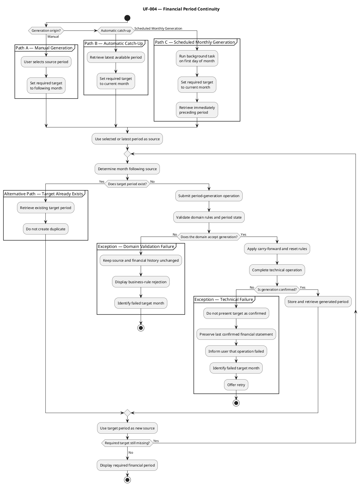

# UF-004 — Financial Period Continuity

## Purpose

Maintain chronological continuity between financial periods by generating the next required period from its immediately preceding period.

## Participating Scenarios

- SC-003 — Access With History but No Current Financial Period.
- SC-004 — Financial Period Overview.
- SC-008 — Financial Period Closing Flow.
- SC-009 — Next Financial Period Generation Flow.

## Entry Conditions

The flow can begin in two contexts:

- Manual generation: the user requests the financial period following a selected period.
- Scheduled monthly generation: a background task runs on the first day of the month and requests generation of the new current financial period.
- Automatic synchronization: Beridian detects that financial history exists but one or more periods are missing before the current month.

## Main Flow

1. Beridian identifies the source financial period.
2. The system determines the immediately following month and year.
3. The system verifies whether the target financial period already exists.
4. If it does not exist, Beridian requests its generation.
5. The domain creates the target period using the source period.
6. The domain applies the corresponding carry-forward and reset rules.
7. The generated financial period is stored.
8. The source period remains unchanged.
9. Beridian retrieves the generated period.
10. The process determines whether another period must be generated.
11. When continuity has been restored, Beridian displays the period required by the originating flow.

## Carry-Forward and Reset Behavior

During generation, the domain applies the previously defined financial period rules:

- The generated period corresponds to the month immediately following its source.
- Planned income is derived from the preceding period’s actual income.
- The new actual income starts at zero.
- Applicable expenses continue according to their type and duration.
- Actual expense values restart according to their generation rules.
- Discretionary expense values restart according to their domain rules.
- Planned investment is recalculated using the planned balance objective.
- Actual investment remains subject to the user’s decision.
- The source period’s remaining balance becomes the transferred balance of the generated period.
- The source period remains open or closed without being modified.

The exact property mapping remains the responsibility of the domain generation operation.

## Operation Paths

### Path A — Manual Generation of One Period

1. The user requests generation from a selected financial period.
2. Beridian determines the next month.
3. The system verifies that the target period does not exist.
4. The user confirms the generation when confirmation is required by the final interaction design.
5. The system generates and stores the target period.
6. Beridian displays the generated financial period.

The location and confirmation behavior of this operation still require a presentation decision.

### Path B — Automatic Catch-Up

1. Beridian detects that the current financial period is missing.
2. The system retrieves the latest available period.
3. The system identifies all missing months.
4. Beridian generates the oldest missing period.
5. The newly generated period becomes the source for the following month.
6. The operation repeats chronologically.
7. The process stops when the current financial period exists.
8. Beridian displays the current financial period.

The user does not need to create each missing period manually.

### Path C — Scheduled Monthly Generation

1. The scheduled background task starts on the first day of the month.
2. The task determines the current month and year.
3. The task verifies whether the current financial period already exists.
4. If it does not exist, the task retrieves the immediately preceding financial
   period.
5. The task requests generation of the current financial period.
6. The domain applies the carry-forward and reset rules.
7. The generated financial period is persisted.
8. The source period remains unchanged.
9. The task finishes successfully.

## Alternative Paths

### Alternative Path — Target Period Already Exists

1. Beridian detects that a financial period already exists for the target month.
2. The system does not create a duplicate.
3. The existing period remains unchanged.
4. In manual generation, Beridian can navigate to the existing period.
5. In automatic catch-up, the existing period becomes the source for evaluating the following month.

## Exception Flows

### Exception Flow — Domain Validation Failure

1. The application submits a structurally valid period-generation operation.
2. The domain evaluates the applicable business rules and financial period state.
3. The domain rejects the operation.
4. The source period and financial history remain unchanged.
5. Beridian communicates why the operation could not be completed.
6. The application identifies the target month that could not be generated.

Possible causes include:

- A required period-generation condition is not satisfied.
- The source financial period cannot generate the requested target period.
- Another financial period business rule prevents the operation.

### Exception Flow — Technical Failure

1. A potentially valid operation cannot be completed or confirmed because of a technical failure.
2. Beridian does not present the attempted change as confirmed.
3. The application preserves the last confirmed financial statement.
4. The system informs the user that the operation could not be completed.
5. The user may retry the operation.

Possible causes include:

- API unavailability.
- Network failure.
- Request timeout.
- Database or persistence failure.
- An unexpected server error.

When the failure occurs during automatic catch-up:

- Beridian stops the generation sequence.
- The application does not skip the failed month.
- The system identifies the target month that could not be generated.
- The synchronization process may retry later.

Whether previously generated periods are preserved or the complete catch-up operation is rolled back remains an implementation decision.

## Final State

After successful completion:

- Financial periods form a continuous monthly sequence up to the required target.
- No duplicate period exists for the same month and year.
- Every generated period follows the domain carry-forward and reset rules.
- Source periods remain unchanged.
- More than one financial period may remain open.
- The required financial period is displayed to the user.

## PlantUML Activity Diagram

