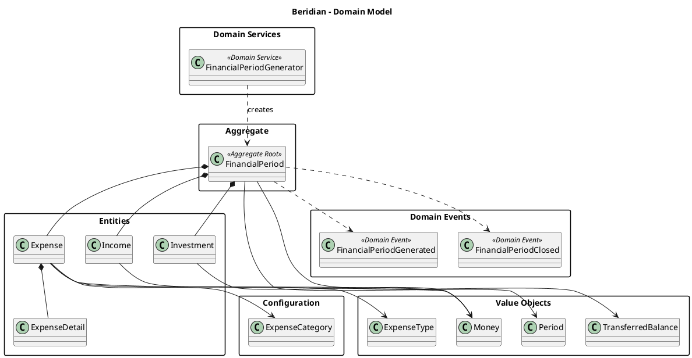

# Domain Model  (What is it?)

## Purpose

The Domain Model represents the core business concepts, rules and behaviors of
the Beridian application.

Its purpose is to capture the ubiquitous language of the domain while defining
clear responsibilities, consistency boundaries and relationships between
business concepts.

This documentation describes the conceptual domain model independently of any
technical implementation.

---

## Design Principles

The Domain Model follows these principles:
- Business rules are independent of infrastructure and external technologies.
- Every domain concept has a single, well-defined responsibility.
- Aggregates define transactional and consistency boundaries.
- Entities encapsulate behavior instead of exposing mutable state.
- Value Objects represent immutable business concepts.
- Domain Services coordinate domain operations that do not naturally belong to a
  single Aggregate, Entity or Value Object.
- Domain Events represent significant business facts that have already occurred.
- Business invariants are enforced by the Domain Model.
- The model expresses the ubiquitous language shared with the business.

---

# Domain Structure (What containing?)

## Aggregates

Aggregates define the transactional boundaries of the domain and protect
business consistency.

| Aggregate | Description |
|------------|-------------|
| [FinancialPeriod](./aggregates/financial-period.md) | Represents a monthly financial period and acts as the Aggregate Root. |

---

## Entities

Entities represent business concepts with identity and lifecycle.

| Entity | Description |
|---------|-------------|
| [Expense](./entities/expense.md) | Planned and actual financial expense. |
| [ExpenseDetail](./entities/expense-detail.md) | Detailed execution of an Expense. |
| [Income](./entities/income.md) | Planned and actual financial income. |
| [Investment](./entities/investment.md) | Planned and actual investment allocation. |

---

## Configurations

Configuration entities define reusable business configuration shared across
FinancialPeriods.

| Configuration | Description |
|---------------|-------------|
| [ExpenseCategory](./configurations/expense-category.md) | Defines reusable expense categories and their business characteristics. |

---

## Value Objects

Value Objects represent immutable business concepts without identity.

| Value Object | Description |
|--------------|-------------|
| [Money](./value-objects/money.md) | Monetary value. |
| [Period](./value-objects/period.md) | Financial period identifier. |
| [ExpenseType](./value-objects/expense-type.md) | Expense classification. |
| [TransferredBalance](./value-objects/transferred-balance.md) | Opening balance transferred from the previous FinancialPeriod. |

---

## Enumerations

Enumerations define controlled business states and classifications.

| Enumeration | Description |
|--------------|-------------|
| [Currency](./enumerations/currency.md) | Supported currencies. |
| [ExpenseState](./enumerations/expense-state.md) | Expense lifecycle. |
| [FinancialPeriodState](./enumerations/financial-period-state.md) | FinancialPeriod lifecycle. |
| [IncomeState](./enumerations/income-state.md) | Income lifecycle. |
| [TransferredBalanceStatus](./enumerations/transferred-balance-status.md) | Indicates whether the transferred balance is provisional or definitive. |

---

## Domain Services

Domain Services coordinate business operations that span multiple domain
concepts.

| Domain Service | Description |
|----------------|-------------|
| [FinancialPeriodGenerator](./domain-services/financial-period-generator.md) | Generates a new FinancialPeriod from a previous one according to the carry-forward rules. |

---

# Domain Events Design Principles (How handling Domain Events)

The domain model follows a conservative approach for Domain Events.
Domain Events exist to communicate significant business facts rather than implementation details or internal state transitions.

---

## Aggregate Ownership

Every Domain Event belongs to an Aggregate Root.
Entities and Value Objects may originate a business fact internally, but the Aggregate Root is responsible for recording the corresponding Domain Event.
This guarantees a single, well-defined point where business facts leave the Aggregate.

---

## Business Meaning

A Domain Event must represent a meaningful business fact.
The existence of a Domain Event should be understandable by business stakeholders using the ubiquitous language.

Examples:
- FinancialPeriodGenerated
- FinancialPeriodClosed

Examples that are intentionally not modeled as Domain Events:
- ExpenseEntered
- IncomeEntered

Those represent internal Aggregate state transitions rather than independent business facts.

---

## Aggregate Consistency

Domain Events are recorded only after the Aggregate has successfully completed its business operation and all invariants have been preserved.
An invalid or partially updated Aggregate must never produce Domain Events.

---

## Event Recording

The Aggregate Root records Domain Events using its internal Domain Events collection after the business operation has completed successfully and all Aggregate invariants have been preserved.
Example:

```csharp

AddDomainEvent(new FinancialPeriodGenerated(...));

```

Recording a Domain Event does not publish it.

---

## Event Publication

Publishing Domain Events is an Infrastructure responsibility.

After the transaction has been successfully committed, the Infrastructure layer retrieves the recorded Domain Events and dispatches them to their consumers.

This keeps the Domain completely independent from messaging technologies or event buses.

---

## Business-Driven Events

A Domain Event is introduced only when at least one of the following conditions is true:
- It represents a significant business fact.
- Other components or bounded contexts may need to react to it.
- It improves business decoupling without exposing implementation details.
Changes that only affect the internal state of an Aggregate should not generate Domain Events.

---

## Technology Independence

Domain Events describe business facts only.
They must not expose infrastructure concerns, persistence details, messaging mechanisms, or implementation-specific information.
The Domain remains independent of any event transport technology.

---

## Current Model

The following principles define when and how Domain Events are introduced in this domain model.

| Domain Event | Description |
|--------------|-------------|
| [FinancialPeriodGenerated](./domain-events/financial-period-generated.md) | Raised when a new FinancialPeriod has been successfully generated and is ready for use. |
| [FinancialPeriodClosed](./domain-events/financial-period-closed.md) | Raised when a FinancialPeriod has been manually closed by the user after satisfying all business rules. |

The project intentionally keeps the number of Domain Events small, ensuring that every event represents a meaningful business fact rather than an internal implementation detail.

---

# Domain Model Diagram
The following diagram provides a high-level conceptual view of the Domain Model.
It illustrates the primary business concepts, their ownership relationships and the Aggregate consistency boundary.
Implementation details, infrastructure concerns and persistence mechanisms are intentionally omitted to keep the diagram focused on the domain.




---

---

## Relationship Legend

The diagram uses the following relationship types to represent the conceptual domain model.

| Relationship | Meaning | Usage in this model |
|--------------|---------|---------------------|
| **Composition (`*--`)** | Strong ownership. The child object belongs exclusively to its parent and shares its lifecycle. | Used between `FinancialPeriod` and its Entities (`Expense`, `Income`, `Investment`), and between `Expense` and `ExpenseDetail`. |
| **Association (`-->`)** | A conceptual relationship where one object references or uses another without owning its lifecycle. | Used for Value Objects (`Money`, `Period`, `TransferredBalance`, `ExpenseType`) and shared configuration (`ExpenseCategory`). |
| **Dependency (`..>`)** | A temporary collaboration where one concept depends on another to perform a business operation but does not own it. | Used by `FinancialPeriodGenerator` to create `FinancialPeriod` instances and by `FinancialPeriod` to record Domain Events. |

---

**Note**

This diagram represents the conceptual relationships of the domain model.

It is intentionally independent of implementation details, persistence mechanisms, object references or infrastructure concerns.


# Directory Structure (Dónde encontrar cada documento)

```text
domain-model/
├── aggregates/
├── configurations/
├── domain-events/
├── domain-services/
├── entities/
├── enumerations/
├── value-objects/
└── README.md
```

Each directory contains the documentation of a specific category of domain
concepts.
Except for Aggregates, every category also provides a `template.md` file to
ensure a consistent documentation structure across the project.

---

### References

Related documentation:
- Business Rules
- Domain Discovery
- Product Roadmap
- Architecture Decision Records (ADRs)