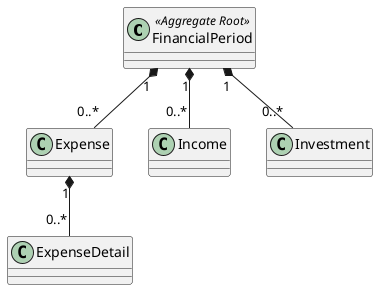

# FinancialPeriod

## Purpose

`FinancialPeriod` is the Aggregate Root of the financial domain.

It represents the complete financial state of a monthly period and defines the transactional boundary for all financial operations performed during that period.
Expenses, incomes, investments and transferred balances have no independent lifecycle outside the FinancialPeriod.
Every business operation affecting expenses, incomes, or investments must be coordinated through the `FinancialPeriod` aggregate to ensure domain consistency.

A single Aggregate Root was chosen because all business consistency is defined within the scope of one monthly financial period.

## Structure

The aggregate is composed of the following domain objects:

- Period
- TransferredBalance
- Expense
- ExpenseDetail
- Income
- Investment

These objects belong exclusively to a single `FinancialPeriod` and cannot exist independently.

The aggregate boundary is illustrated below.

```text
FinancialPeriod
├── Period
├── OpeningBalance: TransferredBalance
├── Expenses
│   └── ExpenseDetails
├── Incomes
└── Investments
```

---

## Lifecycle

A financial period has the following lifecycle:

```text
Open
  │
  │ Close()
  ▼
Closed
```

A newly created financial period always starts in the **Open** state.

The transition to **Closed** is performed manually by the user after verifying that the financial information for the period is complete.

Once closed, the period becomes immutable.

---

## Responsibilities

`FinancialPeriod` is responsible for:

- protecting the aggregate boundary;
- coordinating all financial operations;
- maintaining aggregate consistency;
- controlling the financial period lifecycle;
- validating period closure;
- calculating financial balances;
- preventing modifications to closed periods.
- preserving the transferred opening balance;
- accepting the replacement of a provisional opening balance with its definitive value.
- preserving the validity of the opening balance.

---

## Business Rules

`FinancialPeriod` enforces the following business rules:

- BR-001
- BR-002 
- BR-003
- BR-004
- BR-005
- BR-006
- BR-007
- BR-019
- BR-020
- BR-021
- BR-022
- BR-023

See [business rules ](../analysis/003-business-rules.md) for the complete rule definitions and domain responsibility matrix.

---

## Invariants

The following invariants must always hold true.

| Id | Invariant |
|----|-----------|
| INV-001 | The aggregate always has a valid lifecycle state. |
| INV-002 | Every contained entity belongs to the same FinancialPeriod. |
| INV-003 | Aggregate consistency is preserved after every operation. |
| INV-004 | Financial balances are calculated only from information contained within the aggregate. |
| INV-005 | A closed FinancialPeriod cannot be modified. |
| INV-006 | A closed FinancialPeriod contains no Expense or Income that remains unentered. |
| INV-007 | A definitive opening balance cannot be replaced by a provisional opening balance. |
---

## Notes

The `FinancialPeriod` aggregate defines the consistency boundary of the financial domain.

Objects contained within the aggregate must never be modified directly from outside the aggregate.

Instead, all state-changing operations must be exposed through domain behaviors implemented by the Aggregate Root.

Additional behaviors will be introduced as the domain model evolves.

The generation of a new FinancialPeriod from a previous one is coordinated by the FinancialPeriodGenerator domain service.

---

## UML


