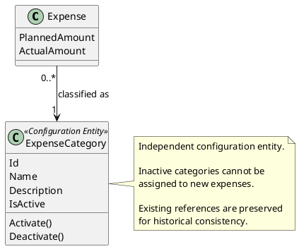

# ExpenseCategory

## Purpose

`ExpenseCategory` represents the business concept associated with an expense.

It identifies what the expense represents, such as electricity, water, internet, fuel, transportation, or vacation.

A category can be reused by expenses belonging to different financial periods.

---

## Structure

An expense category contains the following information:

- unique identifier;
- name;
- optional description;
- active status.

```text
ExpenseCategory
├── Id
├── Name
├── Description (optional)
└── IsActive
```

The category describes the meaning of the expense but does not define how the expense behaves when a new financial period is generated.

That behavior is determined by `ExpenseType`.

---

## Lifecycle

An expense category has a configuration lifecycle:

```text
Active
   │
   │ Deactivate()
   ▼
Inactive
   │
   │ Activate()
   ▼
Active
```

An inactive category cannot be assigned to new expenses.

Existing expenses may continue referencing an inactive category to preserve historical information.

A category should not be physically deleted when it has already been used by an expense.

---

## Responsibilities

`ExpenseCategory` is responsible for:

- identifying the business meaning of an expense;
- maintaining its name and optional description;
- controlling whether it is available for new expenses;
- preserving its identity across financial periods;
- preventing invalid configuration changes.

It is not responsible for:

- planned or actual amounts;
- expense lifecycle;
- carry-forward behavior;
- calculation rules;
- period generation.

---

## Business Rules

No business rule from the current set is exclusively enforced by `ExpenseCategory`.

It supports the enforcement of:

- BR-013 — Expenses are classified according to business behavior.

However, BR-013 is primarily coordinated by `Expense`, because classification involves both category and type.

See [business rules ](../analysis/003-business-rules.md) for the complete rule definitions and domain responsibility matrix.

---

## Invariants

| Id | Invariant |
|----|-----------|
| INV-030 | Every expense category has a unique identity. |
| INV-031 | Every expense category has a non-empty name. |
| INV-032 | An inactive category cannot be assigned to a new expense. |
| INV-033 | A category already referenced by an expense must preserve its historical identity. |
| INV-034 | Category activation changes must follow a valid lifecycle transition. |

---

## Notes

`ExpenseCategory` is not part of the `FinancialPeriod` aggregate.

```text
FinancialPeriod Aggregate
└── Expense
        │
        └── references ExpenseCategory

Configuration
└── ExpenseCategory
```

The relationship is by reference rather than composition:

- deleting a financial period does not delete its categories;
- the same category can be referenced from multiple periods;
- the category has an independent configuration lifecycle.

Examples of categories include:

```text
Electricity
Water
Gas
Internet
Fuel
Transportation
Vacation
Personal Expenses
```

Category and type represent different dimensions:

```text
Category → What is the expense?
Type     → How does the expense behave?
```

For example:

```text
Category: Electricity
Type:     Recurring Variable
```

```text
Category: Laptop
Type:     Fixed-Term Installment
```

The exact representation of `ExpenseType` remains pending until the Value Objects section is reviewed.

---

## UML


