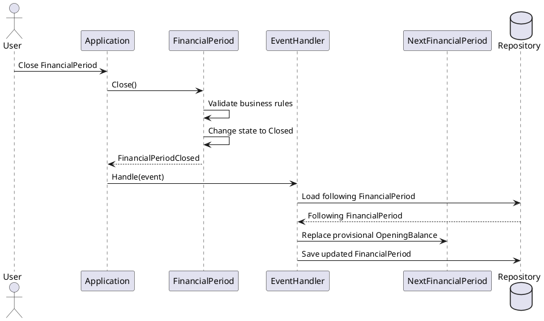

# FinancialPeriodClosed

## Purpose

Represents that a `FinancialPeriod` has successfully completed its lifecycle and
transitioned from `Open` to `Closed`.

This event indicates that:

- all required business validations have been satisfied;
- the period's remaining balance is definitive;
- the financial period can no longer be modified;
- subsequent business processes may now react to the completed period.

---

## Lifecycle

The event is raised after a successful state transition.

```text
FinancialPeriod

Open
 │
 │ Close()
 ▼
Closed
 │
 ▼
FinancialPeriodClosed
```

The event is raised only when the transition completes successfully.

---

## Raised By

Aggregate:

- `FinancialPeriod`

Operation:

```text
FinancialPeriod.Close()
```

The event is generated by the Aggregate Root after:

1. validating all business rules;
2. changing its lifecycle state;
3. preserving all aggregate invariants.

Application invokes the operation but does not create the event.

---

## Event Contract

The event contains the information required by downstream business processes.

| Field | Description |
|--------|-------------|
| FinancialPeriodId | Identifier of the closed aggregate. |
| Period | Closed financial period. |
| ClosedAt | Date and time of the successful closure. |
| DefinitiveRemainingBalance | Final remaining balance of the period. |

---

## Interaction

The event may trigger additional application workflows.

```text
FinancialPeriod
        │
        │ raises
        ▼
FinancialPeriodClosed
        │
        ▼
Application
        │
        ├── Locate following FinancialPeriod
        ├── Update provisional OpeningBalance
        ├── Persist changes
        └── Publish integration events (future)
```

The Aggregate does not directly interact with other aggregates.

Cross-aggregate coordination belongs to the Application layer.

---

## Sequence Diagram



---

## Business Rules

This event is associated with:

- BR-003
- BR-004
- BR-006
- BR-007

---

## Domain Responsibilities

### FinancialPeriod

Responsible for:

- validating the closing operation;
- changing its lifecycle state;
- calculating the definitive remaining balance;
- raising the `FinancialPeriodClosed` event.

### Application

Responsible for:

- coordinating cross-aggregate reactions;
- locating the following financial period;
- updating the transferred opening balance when required;
- persisting the resulting changes.

---

## Future Consumers

Potential consumers of this event include:

- Opening balance synchronization.
- Audit logging.
- Notification services.
- Financial reporting.
- External integrations.

## Notes

The existence of a following `FinancialPeriod` is not required.

If no following period exists, the event remains valid and no additional domain
operation is executed.

The event represents a completed business fact and is never cancelled or rolled
back after being raised.