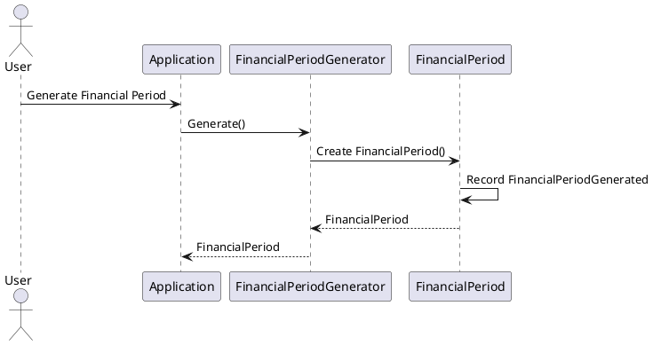

# FinancialPeriodGenerated

## Purpose

`FinancialPeriodGenerated` is raised when a new FinancialPeriod has been successfully generated and is ready for use.

This event represents the successful completion of the financial period generation process, including the creation of the new aggregate and the initialization of its business information.

It communicates a business fact rather than an internal state transition.

---

# Lifecycle

```text
User
    │
    ▼
Generate Financial Period
    │
    ▼
FinancialPeriodGenerator
    │
    ▼
FinancialPeriod
    │
    ▼
FinancialPeriodGenerated
```

The previous FinancialPeriod is not required to be closed before generating the new one.

---

# Raised By

Aggregate Root:

- FinancialPeriod

Business operation:

- Generate Financial Period

---

# Event Contract

| Field | Description |
|--------|-------------|
| FinancialPeriodId | Identifier of the generated FinancialPeriod. |
| Period | Financial period represented by the aggregate. |
| OpeningBalance | Opening balance assigned during generation. |
| GeneratedAt | Date and time when the event occurred. |

---

# Business Meaning

The event indicates that a new FinancialPeriod has been fully initialized and is available for business operations.

The generation process may include:

- Creating the new FinancialPeriod.
- Copying recurring expenses.
- Copying fixed-term expenses.
- Resetting actual values.
- Initializing planned values.
- Assigning the transferred opening balance.
- Determining the transferred balance status.

Consumers do not need to understand how the period was generated.

They only need to know that a new FinancialPeriod is available.

---

# Interaction

```text
Application
        │
        ▼
FinancialPeriodGenerator
        │
        ▼
FinancialPeriod
        │
        ▼
FinancialPeriodGenerated
```

The Domain Service coordinates the generation process.

The Aggregate Root records the Domain Event.

---

# Sequence Diagram



---

# Business Rules

- BR-019 — Generate next FinancialPeriod.
- BR-020 — Carry forward business concepts.

---

# Domain Responsibilities

FinancialPeriod

- Records the Domain Event.
- Represents the generated aggregate.

FinancialPeriodGenerator

- Coordinates the generation process.
- Applies generation business rules.
- Initializes the new FinancialPeriod.

---

# Future Consumers

Possible future consumers include:

- Audit logging.
- User notifications.
- Dashboard updates.
- Reporting.
- Analytics.
- External integrations.

---

# Notes

This event represents a business fact.

It does not expose the internal generation algorithm or aggregate implementation details.

The previous FinancialPeriod may still be in the Open state when this event is raised.