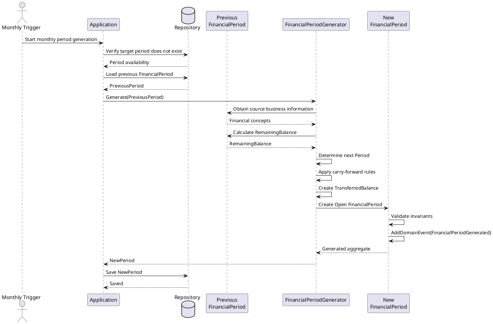
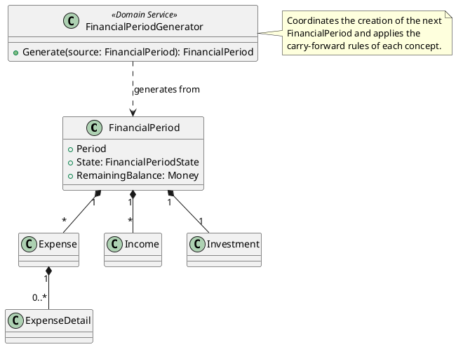

# Financial Period Generator

## Purpose

This document describes how a new `FinancialPeriod` is generated from the
previous one.

Financial period generation is a domain process because the new period is not
created as an empty structure. It is initialized using business information from
the previous period and applying the carry-forward behavior defined for each
financial concept.

The process is coordinated by the `FinancialPeriodGenerator` Domain Service.

---

## Business Context

Financial planning is organized into monthly financial periods.

When a new month begins, the user normally starts from the previous financial
period rather than rebuilding the complete financial plan manually.

The next period may be generated even when the previous period is still `Open`.
In that situation, some transferred information, particularly the remaining
balance, may still be provisional.

Once the previous period is closed, its definitive remaining balance becomes the
opening balance of the following period.

---

## Generation Trigger

The next `FinancialPeriod` must be generated on the first day of each month.

The monthly trigger initiates the generation use case, but it does not contain
business rules and does not create the new period directly.

The trigger belongs outside the Domain layer.

```text
First day of the month
          │
          ▼
Scheduled Application Process
          │
          ▼
FinancialPeriodGenerator
          │
          ▼
New FinancialPeriod
```

## Generation Overview

```text
Previous FinancialPeriod
          │
          ▼
FinancialPeriodGenerator
          │
          ├── Determines the next Period
          ├── Transfers eligible Expenses
          ├── Initializes Income
          ├── Initializes Investment
          ├── Transfers the remaining balance
          └── Applies concept-specific carry-forward rules
          │
          ▼
New FinancialPeriod
```

The generated `FinancialPeriod` always starts in the `Open` state.

The previous and newly generated periods remain independent aggregates after the
generation process is complete.

---

## Participants

### Previous FinancialPeriod

Provides the business information used as the source for generating the new
period.

It remains responsible for:

- its lifecycle state;
- its Expenses;
- its Incomes;
- its Investment;
- calculating its remaining balance;
- protecting its internal consistency.

The previous period does not create or modify another `FinancialPeriod`
directly.

---

### FinancialPeriodGenerator

`FinancialPeriodGenerator` is a Domain Service responsible for coordinating the
creation of the following financial period.

It is used because the generation process:

- works with information from one `FinancialPeriod`;
- creates another `FinancialPeriod`;
- applies rules belonging to different financial concepts;
- does not naturally belong to a single Entity or Value Object.

#### Responsibilities

- Determine the period immediately following the source period.
- Generate the new `FinancialPeriod` in the `Open` state.
- Coordinate the carry-forward of financial concepts.
- Transfer only the Expenses that remain applicable.
- Reinitialize transferred financial execution values.
- Initialize Income according to its carry-forward rule.
- Initialize Investment according to its carry-forward rule.
- Transfer the previous period's remaining balance.
- Indicate whether the transferred balance is provisional or definitive.
- Preserve the independence and consistency of both aggregates.

The generator coordinates the process but does not replace the behavior owned by
the individual financial concepts.

---

### New FinancialPeriod

The generated period is a new and independent aggregate.

It must:

- represent the month immediately following the source period;
- begin in the `Open` state;
- contain only financial concepts applicable to the new period;
- contain newly created entities rather than references to entities owned by the
  previous aggregate;
- start with reinitialized actual execution values;
- preserve the planned information determined by each carry-forward rule;
- receive the transferred balance as opening financial information.

---

## Generation Preconditions

The next financial period may be generated when:

- a valid source `FinancialPeriod` exists;
- the requested period is the immediate successor of the source period;
- another financial period for the same month has not already been created.

The source period is not required to be `Closed`.

```text
Source Open   ──► Generation allowed
Source Closed ──► Generation allowed
```

The lifecycle state of the source period affects the status of the transferred
balance, but it does not prevent generation.

---

## Generation Workflow

### 1. Determine the next period

The generator determines the monthly period immediately following the source
`FinancialPeriod`.

Example:

```text
Source period: July 2026
Next period:   August 2026
```

The caller cannot use the generation process to create an unrelated or
non-consecutive financial period.

---

### 2. Create the new FinancialPeriod

A new `FinancialPeriod` is created for the next month.

Its initial lifecycle state is:

```text
FinancialPeriodState.Open
```

At this point, the new aggregate does not share owned entities with the source
aggregate.

---

### 3. Carry forward Expenses

The generator evaluates the Expenses contained in the source period.

Carry-forward behavior depends on the business meaning of each Expense.

```text
Expense
   │
   ├── Recurring      ──► Continue
   ├── Fixed-term     ──► Continue while not completed
   └── Discretionary  ──► Reinitialize
```

Each transferred Expense becomes a new entity belonging exclusively to the new
`FinancialPeriod`.

Actual execution information is not copied as actual execution for the new
period.

---

### 4. Initialize Income

Income information is carried forward according to the Income initialization
rules.

For an Income continuing into the next financial period:

- the previous actual amount becomes the new planned amount;
- the new actual amount starts at zero;
- the new Income starts in its initial lifecycle state.

The generated Income belongs exclusively to the new aggregate.

---

### 5. Initialize Investment

Investment is initialized for the new financial period according to its business
rules.

The planned financial distribution must preserve the rule that the planned
remaining balance is allocated to Investment, leaving the planned balance at
zero.

Actual investment is initialized independently from the actual investment of the
source period.

---

### 6. Transfer the remaining balance

The remaining balance of the source period is transferred as the opening balance
of the new period.

Its meaning depends on the lifecycle state of the source period.

#### Source period is Open

```text
Source FinancialPeriod: Open
Remaining balance:      Calculated but not definitive
Transferred balance:    Provisional
```

The transferred value may change because the source period can still receive
financial updates.

#### Source period is Closed

```text
Source FinancialPeriod: Closed
Remaining balance:      Definitive
Transferred balance:    Definitive
```

The definitive remaining balance becomes the opening balance of the following
financial period.

---

## Carry-Forward Rules

### Recurring Expenses

Recurring Expenses continue into the next period unless the user has explicitly
decided that they no longer apply.

Examples include:

- electricity;
- water;
- gas;
- internet;
- mobile services;
- other recurring household obligations.

The Expense structure is preserved, while actual execution values are
reinitialized.

Some recurring Expenses may determine their new planned amount using historical
information, such as the amount recorded for the equivalent month of the previous
year.

---

### Fixed-Term Expenses

A fixed-term Expense continues only while its payment schedule has not been
completed.

Examples include:

- installment purchases;
- temporary financial obligations;
- expenses identified by a current installment and a total number of
  installments.

When carried forward:

- the Expense remains associated with the same obligation;
- the installment position advances;
- the planned installment amount is carried forward according to the obligation;
- the actual amount starts at zero.

A completed fixed-term Expense must not be transferred to the new period.

---

### Discretionary Expenses

Discretionary Expenses continue as planning categories but their execution is
reinitialized.

For example, the `Mis Gastos` discretionary category:

- starts with an actual amount of zero;
- may preserve the detail descriptions used for planning;
- reinitializes detail amounts to zero;
- assigns new detail dates within the generated period where required.

Historical actual spending is not copied as new actual spending.

---

### Expense Details

When an Expense carries its planning structure forward, its detail descriptions
may also be carried forward.

Transferred Expense Details:

- become new entities;
- belong to the new Expense and the new `FinancialPeriod`;
- do not preserve previous actual amounts;
- use dates valid for the new period where dates are required.

The generator must never reuse an `ExpenseDetail` instance from the source
aggregate.

---

### Income

Income continues as a planning concept for the next financial period.

Its initialization follows this behavior:

```text
Previous ActualAmount ──► New PlannedAmount
Zero                  ──► New ActualAmount
Initial state         ──► New IncomeState
```

Income does not contain detail entities.

---

### Investment

Investment is recalculated as part of the planned distribution of the new
financial period.

It is not copied as historical execution.

Its initialization must ensure consistency between:

- planned Income;
- planned Expenses;
- opening balance;
- planned Investment;
- planned remaining balance.

---

### Previous Remaining Balance

The source period's remaining balance is transferred to the next period as
opening financial information.

The transferred amount carries a status:

```text
Provisional
Definitive
```

This status is derived from the lifecycle state of the source period.

The transferred balance is not definitive while the source period remains
`Open`.

---

## Provisional Balance Synchronization

When the next period is generated from an `Open` source period, its transferred
balance is provisional.

Later, when the source period is closed, the opening balance of the next period
must be updated using the definitive remaining balance.

```text
Source period generated while Open
              │
              ▼
Next period receives provisional balance
              │
              ▼
Source period is Closed
              │
              ▼
Definitive remaining balance is obtained
              │
              ▼
Next period opening balance is updated
```

This synchronization is part of the wider cross-period workflow.

The source `FinancialPeriod` does not directly modify the following aggregate.
Application coordinates the operation by:

1. loading the closed source period;
2. obtaining its definitive remaining balance;
3. loading the following period;
4. invoking the corresponding domain behavior;
5. persisting the updated aggregate.

Application coordinates the use case, while the domain determines whether the
balance is valid and how it is represented.

---

## Application Coordination

The Application layer is responsible for orchestrating the generation use case.

A typical workflow is:

```text
Application
    │
    ├── Receives the monthly generation trigger
    ├── Determines the financial period to generate
    ├── Verifies that the period does not already exist
    ├── Loads the immediately previous FinancialPeriod
    ├── Invokes FinancialPeriodGenerator
    ├── Receives the generated FinancialPeriod
    └── Persists the new aggregate
```

Application is responsible for coordination and access to persisted information.

Application does not decide:

which Expenses continue;
when a fixed-term Expense is completed;
how an Expense is reinitialized;
how Income is initialized;
how Investment is initialized;
whether the transferred balance is provisional or definitive;
how the generated period preserves business consistency.

Those decisions belong to the Domain Model.

---

## Domain Consistency

The generation process must preserve the following conditions:

- The source period remains unchanged by the generation operation.
- The generated period is a separate aggregate.
- Every generated entity belongs to the generated period.
- No Entity instance is shared between financial periods.
- The new period represents the immediate successor of the source period.
- The new period starts in the `Open` state.
- Actual execution values from the source period are not interpreted as actual
  execution in the new period.
- Completed fixed-term Expenses are not transferred.
- The transferred balance accurately indicates whether it is provisional or
  definitive.
- All aggregate invariants remain valid after generation.

These conditions describe the consistency of the generation process. They do not
add new internal invariants to the `FinancialPeriod` aggregate.

---

## Generation Result

A successful generation produces a new and independent `FinancialPeriod`
Aggregate.

The generated Aggregate:

- represents the month immediately following the source period;
- starts in the `Open` state;
- contains newly created domain entities;
- contains the applicable financial planning information;
- starts with reinitialized execution values;
- contains a valid `TransferredBalance`;
- records the `FinancialPeriodGenerated` Domain Event.

The event is recorded only after the generated Aggregate is valid and all its
invariants have been preserved.

Recording the event does not publish it.

## Design Decisions

### Generation is implemented as a Domain Service

The generation process does not belong entirely to the source or destination
`FinancialPeriod`.

`FinancialPeriodGenerator` coordinates the process while preserving the
responsibilities of each domain concept.

---

### Financial concepts own their carry-forward behavior

The generator coordinates the generation but must not become a container for all
financial business rules.

Each financial concept determines the behavior that belongs to it.

```text
FinancialPeriodGenerator
    coordinates

Expense
    determines expense carry-forward behavior

Income
    determines income initialization behavior

Investment
    determines investment initialization behavior

FinancialPeriod
    calculates the remaining balance
```

---

### Generated entities are new domain objects

Entities from the source period are not moved or reused.

The generation process creates new entities using the relevant business
information from the source concepts.

This preserves aggregate ownership and transactional boundaries.

---

### Operational and historical values are not the same

The actual amount from the source period is historical information.

It may be used to determine a planned value for the next period, but it does not
become the actual value of the new period.

---

### The transferred balance may be provisional

Generating a new period before closing the previous one is valid.

Therefore, the model must distinguish between a provisional transferred balance
and a definitive transferred balance.

---

## Related Business Rules

- BR-005 — A new FinancialPeriod may coexist with the previous one.
- BR-006 — The transferred balance may be provisional.
- BR-007 — The remaining balance is transferred to the next financial period.
- BR-019 — A new financial period starts from the previous one.
- BR-020 — Carry-forward behavior depends on the business concept.

Additional rules related to Expense, Income and Investment determine the detailed
carry-forward behavior of each concept.

---

## Sequence Diagram



---

## UML



---

### Transferred Balance

The balance transferred from one FinancialPeriod to the next is represented by
the `TransferredBalance` Value Object.

It contains:

- `Amount`, represented by Money;
- `Status`, represented by TransferredBalanceStatus.

The available statuses are:

- `Provisional`;
- `Definitive`.

A TransferredBalance is immutable and has no identity of its own.

Its status is determined from the lifecycle state of the source FinancialPeriod:

- an Open source period produces a Provisional transferred balance;
- a Closed source period produces a Definitive transferred balance.
