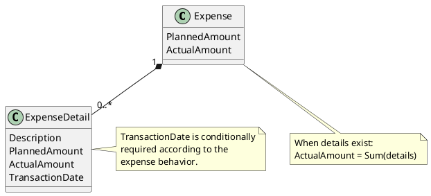

# ExpenseDetail

## Purpose

`ExpenseDetail` represents an individual financial entry associated with an expense.

It allows an expense to be decomposed into multiple records when the business requires detailed tracking of its actual execution.

An `ExpenseDetail` cannot exist independently and always belongs to exactly one `Expense`.

---

## Structure

An expense detail contains the following information:

- description;
- optional planned amount;
- actual amount;
- optional transaction date, depending on the expense behavior.

```text
Expense
└── ExpenseDetail
    ├── Description
    ├── PlannedAmount (optional)
    ├── ActualAmount
    └── TransactionDate (conditionally required)
```    
---

## Lifecycle

`ExpenseDetail` does not have an independent business lifecycle.

Its lifecycle is controlled by the owning `Expense`:

```text
Expense created
      │
      ├── ExpenseDetail added
      ├── ExpenseDetail modified
      └── ExpenseDetail removed
```

When the owning expense or financial period is no longer modifiable, its detail records must also become non-modifiable.

---

## Responsibilities

`ExpenseDetail` is responsible for:

- representing an individual expense entry;
- maintaining its description and actual amount;
- recording the transaction date when required;
- validating its own data;
- contributing to the actual amount calculated by the owning expense.

The owning `Expense` remains responsible for managing the collection of details and calculating the total actual amount.

---

## Business Rules

`ExpenseDetail` participates in the enforcement of the following business rules:

- BR-010
- BR-011
- BR-012

The rules are owned and coordinated by `Expense`.

See [business rules ](../analysis/003-business-rules.md) for the complete rule definitions and domain responsibility matrix.

---

## Invariants

The following invariants must always hold true.

| Id | Invariant |
|----|-----------|
| INV-011 | An expense detail belongs to exactly one expense. |
| INV-012 | An expense detail cannot exist independently from its owning expense. |
| INV-013 | The actual amount of a detail cannot be negative. |
| INV-014 | A description is required for every expense detail. |
| INV-015 | A transaction date is required when the expense behavior requires date-based tracking. |
| INV-016 | The planned amount of a detail is optional. |
| INV-017 | A detail planned amount does not replace or determine the planned amount of the owning expense. |

---

## Notes

The planned amount of an expense detail is optional.

It may be used to distribute or describe the planning of individual entries, but the planned amount defined at the `Expense` level remains authoritative.

When details exist, the actual amount of the expense is derived from the sum of their actual amounts.

```text
Expense.ActualAmount =
    Sum(ExpenseDetails.ActualAmount)
```

---

## UML


