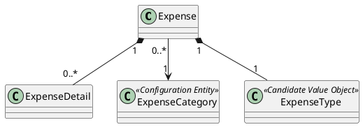

# Expense

## Purpose

`Expense` represents a planned financial obligation within a financial period.

It encapsulates the business behavior associated with expenses, including planning, execution, classification, lifecycle management, and actual amount calculation.

An `Expense` always belongs to exactly one `FinancialPeriod`.

---

## Structure

An expense contains the following information:

- expense category;
- expense type;
- planned amount;
- actual amount;
- business state;
- optional collection of expense details.

When detail records exist, they belong exclusively to the owning expense.

```text
Expense
├── ExpenseCategory (reference)
├── ExpenseType
└── ExpenseDetails (optional)
```
---

## Lifecycle

Every expense progresses through the following business lifecycle.

```text
Created
   │
   │ Register()
   ▼
Entered
```

The transition from **Created** to **Entered** occurs when the business considers the expense to have been entered, regardless of whether it contains detail records.

---

## Responsibilities

`Expense` is responsible for:

- managing planned and actual amounts;
- maintaining its business lifecycle;
- classifying business behavior;
- managing optional detail records;
- calculating the actual amount from detail records;
- protecting its own business invariants.

---

## Business Rules

`Expense` enforces the following business rules.

- BR-008
- BR-009
- BR-010
- BR-011
- BR-012
- BR-013
- BR-014

See [business rules ](../analysis/003-business-rules.md) for the complete rule definitions and domain responsibility matrix.

---

## Invariants

The following invariants must always hold true.

| Id | Invariant |
|----|-----------|
| INV-006 | Every expense belongs to exactly one financial period. |
| INV-007 | Every expense has a planned amount. |
| INV-008 | Actual amount is never entered manually when detail records exist. |
| INV-009 | Detail records belong exclusively to one expense. |
| INV-010 | The expense lifecycle is always valid. |

---

## Notes

The planned amount represents the expected financial commitment and remains independent from execution.

Actual execution may occur either directly on the expense or indirectly through its detail records.

An expense distinguishes between category and type:

- `ExpenseCategory` identifies what the expense represents, such as electricity, water, internet, or fuel.
- `ExpenseType` defines how the expense behaves within the financial process.

`ExpenseCategory` is modeled as a configuration entity that can be referenced by multiple expenses across different financial periods.

`ExpenseType` is currently considered a candidate Value Object. Its final modeling decision will be made when the Value Objects section is developed.

The expense references an `ExpenseCategory`, but the category does not belong to the `FinancialPeriod` aggregate.

---

## UML


