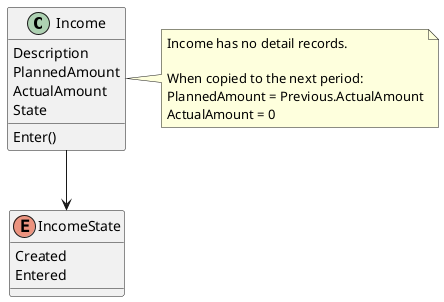

# Income

## Purpose

`Income` represents an expected financial inflow within a financial period.

It encapsulates the planning and execution of income without requiring detail records.

An `Income` always belongs to exactly one `FinancialPeriod`.

---

## Structure

An income contains the following information:

- description;
- planned amount;
- actual amount;
- business state.

```text
Income
├── Description
├── PlannedAmount
├── ActualAmount
└── State
```

Unlike an expense, an income does not contain detail records. Its planned and actual amounts are managed directly by the income entity.

---

## Lifecycle

Every income progresses through the following business lifecycle:

```text
Created
   │
   │ Enter()
   ▼
Entered
```

The `Created` state indicates that the income has been defined for the financial period but its actual amount has not yet been confirmed.

The `Entered` state indicates that the user has registered or confirmed the actual income amount.

The transition is explicit and represents a business decision rather than being inferred only from the presence of an amount.

---

## Responsibilities

`Income` is responsible for:

- managing its planned amount;
- managing its actual amount;
- maintaining its business lifecycle;
- confirming when the income has been entered;
- protecting its own business invariants;
- providing the actual amount used to plan the following financial period.

---

## Business Rules

`Income` enforces the following business rules:

- BR-015
- BR-016

See `docs/analysis/003-business-rules.md` for the complete rule definitions.

---

## Invariants

The following invariants must always hold true.

| Id | Invariant |
|----|-----------|
| INV-018 | An income belongs to exactly one financial period. |
| INV-019 | Every income has a planned amount. |
| INV-020 | An income does not contain detail records. |
| INV-021 | The income lifecycle must always represent a valid transition. |
| INV-022 | A newly generated income starts with its actual amount at zero. |
| INV-023 | The actual amount is managed directly by the income entity. |

---

## Notes

Planning and execution remain independent:

- `PlannedAmount` represents the expected income.
- `ActualAmount` represents the income effectively received or confirmed.

When a new financial period is generated from the previous one, the previous actual income becomes the planned amount of the new income:

```text
NewIncome.PlannedAmount =
    PreviousIncome.ActualAmount

NewIncome.ActualAmount = 0
```

This behavior provides a planning baseline but does not imply that the new period will receive the same actual amount.

The `Entered` state does not necessarily mean that the actual amount is greater than zero. It means that the user has explicitly reviewed and confirmed the income for the financial period.

---

## UML


