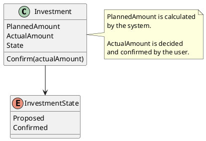

# Investment

## Purpose

`Investment` represents the financial amount that may be invested within a financial period and the amount that the user ultimately decides to invest.

The planned investment is calculated by the system, while the actual investment is explicitly decided and confirmed by the user.

An `Investment` always belongs to exactly one `FinancialPeriod`.

---

## Structure

An investment contains the following information:

- planned amount;
- actual amount;
- business state.

```text
Investment
├── PlannedAmount
├── ActualAmount
└── State
```

---

## Lifecycle

Every investment progresses through the following lifecycle:

```text
Proposed
   │
   │ Confirm(actualAmount)
   ▼
Confirmed
```

The Proposed state indicates that the system has calculated the planned investment, but the user has not yet confirmed the actual amount.

The Confirmed state indicates that the user has explicitly decided how much will actually be invested.

---

## Responsibilities

Inve`Investment` is responsible for:

- holding the investment amount proposed by the system;
- receiving the actual amount decided by the user;
- maintaining its confirmation lifecycle;
- ensuring that the confirmed amount does not exceed the available amount;
- maintaining the separation between planning and execution.

---

## Business Rules

`Investment` enforces or participates in the following business rules:

BR-017
BR-018
BR-021
BR-022

See [business rules ](../analysis/003-business-rules.md) for the complete rule definitions and domain responsibility matrix.

---

## Invariants

The following invariants must always hold true.

| Id | Invariant |
|----|-----------|
| INV-023 | An investment belongs to exactly one financial period. |
| INV-024 | Planned and actual investment values remain independent. |
| INV-025 | Investment values are derived from the financial information of the owning period. |
| INV-026 | Investment does not contain detail records. |
| INV-027 | The confirmed actual investment cannot exceed the available amount |.
| INV-028 | Only a valid lifecycle transition can change the investment state |.
| INV-029 | Investment does not contain detail records |.

---

## Calculation Rules

The planned investment is calculated during planning:

```text
PlannedInvestment =
    TotalPlannedIncome
    - TotalPlannedExpenses
```

The amount available when the user makes the actual investment decision is calculated using current income and planned expenses:
```text
AvailableInvestmentAmount =
    TotalActualIncome
    - TotalPlannedExpenses
```

The user may confirm any valid amount within the available limit:
```text
0 <= ActualInvestment <= AvailableInvestmentAmount
```

---

## Notes

The planned investment represents the amount proposed by the financial plan.

The actual investment represents a deliberate financial decision made by the user.

The actual amount may be lower than the available amount because the user may decide to preserve part of the remaining balance.

A financial period can only be closed when its investment has been confirmed.

---

## UML


