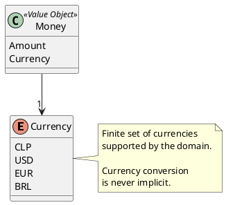

# Currency

## Purpose

`Currency` identifies the monetary unit in which a `Money` value is expressed.

It allows the domain to distinguish amounts belonging to different currencies and prevents incompatible monetary values from being combined without an explicit currency conversion.

Examples:

```text
Money(150000, CLP)
Money(250.50, USD)
Money(100.00, EUR)
```

---

## Values

The domain initially recognizes the following currencies:

| Value | Description |
|-------|-------------|
| CLP | Chilean Peso |
| USD | United States Dollar |
| EUR | Euro |
| BRL | Brazilian Real |

The enumeration can be extended when the application formally supports additional currencies.

---

## Responsibilities

`Currency` is responsible for:

- identifying the currency associated with a monetary amount;
- providing a finite set of currencies recognized by the domain;
- supporting currency compatibility validation in `Money`;
- participating in monetary equality and comparison operations.

`Currency` is not responsible for:

- storing exchange rates;
- converting monetary values;
- obtaining market prices;
- formatting monetary values;
- determining currency symbols or localized descriptions.

Those responsibilities belong outside the enumeration.

---

## Business Rules

`Currency` does not own an independent business rule.

It supports monetary operations performed by `Money`, particularly the rule that monetary values can only be added, subtracted, or directly compared when they use the same currency.

Currency conversion, if introduced later, must be an explicit operation performed before combining values from different currencies.

---

## Invariants

| Id | Invariant |
|----|-----------|
| INV-069 | Every `Money` value must be associated with a valid `Currency`. |
| INV-070 | A `Currency` value must belong to the finite set recognized by the domain. |
| INV-071 | Two monetary values are currency-compatible only when their `Currency` values are equal. |
| INV-072 | Currency conversion must never occur implicitly. |

---

## Notes

`Currency` is modeled as a domain enumeration because:

- the application works with a finite set of supported currencies;
- currencies do not require an independent identity within this domain;
- currencies do not have a lifecycle;
- users do not create or modify currencies;
- each supported currency can be represented by a stable ISO-style code.

The currency code is the authoritative value.

Symbols should not be used as identifiers because different currencies may share the same symbol.

For example:

```text
CLP → $
USD → $
```

The symbol may be selected later by the presentation layer according to localization requirements.

Currency metadata such as display name, symbol, and decimal precision may be defined outside the enumeration if required:

```text
CurrencyMetadata
├── DisplayName
├── Symbol
└── DecimalPlaces
```

That metadata does not change the identity of the domain enumeration.

---

## UML


