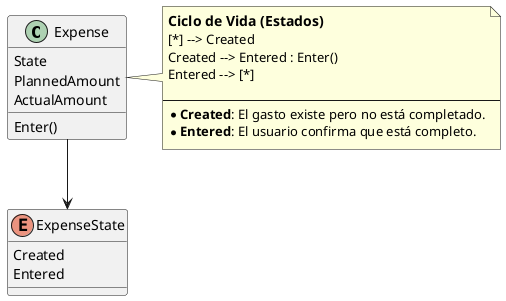

# ExpenseState

## Purpose

`ExpenseState` represents the current execution state of an `Expense`.

It indicates whether the expense has only been created as part of the financial planning or whether its actual financial information has already been entered by the user.

The domain recognizes two states:

```text
Created
Entered
```

---

## Structure

| State | Meaning |
|-------|---------|
| Created | The expense exists in the financial period, but its actual execution has not yet been completed. |
| Entered | The user has completed the actual financial information required for the expense. |

`ExpenseState` represents a finite set of domain values and does not have an independent identity.

---

## Lifecycle

An expense follows the lifecycle below:

```text
Created
   │
   │ Enter()
   ▼
Entered
```

Every newly created expense starts in the `Created` state.

The transition to `Entered` occurs when the user explicitly confirms that the expense information has been completed.

The current domain model does not define an automatic transition based only on the actual amount.

---

## Responsibilities

`ExpenseState` is responsible for representing whether an expense:

- remains pending during financial execution;
- has already been completed by the user;
- satisfies its lifecycle requirement for closing the financial period.

The state does not validate the expense information by itself.

The `Expense` entity controls the transition and verifies that the required business information is consistent before entering the final state.

---

## Business Rules

`ExpenseState` participates in the enforcement of the following business rules:

- BR-009 — The actual amount of a newly generated expense starts at zero.
- BR-010 — An expense may contain detail records.
- BR-011 — When details exist, the actual amount is calculated from them.
- BR-014 — An expense progresses through its business lifecycle.
- BR-022 — Financial consistency must be achieved before closing the period.


See [business rules ](../analysis/003-business-rules.md) for the complete rule definitions and domain responsibility matrix.

---

## Invariants

| Id | Invariant |
|----|-----------|
| INV-045 | An expense must always have a valid state. |
| INV-046 | Every newly created expense starts in the Created state. |
| INV-047 | An expense can transition only from Created to Entered. |
| INV-048 | The transition to Entered must be explicitly initiated by the user. |
| INV-049 | The expense state cannot be inferred only from the value of its actual amount. |

---

## Entry Conditions

The transition from `Created` to `Entered` is controlled by the `Expense` entity.

Before completing the transition, the expense must validate the information required by its structure and type.

Possible validation conditions include:

- the actual amount is valid;
- when details exist, the actual amount corresponds to the sum of their actual amounts;
- required detail dates have been entered;
- the expense information is internally consistent.

```text
Expense.Enter()

    Validate actual amount
    Validate expense details
    Validate required dates
    Validate consistency
             │
             ▼
       State = Entered
```

The exact validation requirements may vary according to the expense type and whether the expense contains details.

---

## Notes

The `Entered` state means that the user considers the expense information complete.

It does not mean that the expense must have an actual amount greater than zero.

For example, an expense may be validly entered with an actual amount of zero when:

- the expected charge did not occur;
- the expense was not incurred during the period;
- the user explicitly confirms that no actual amount must be recorded.

Therefore:

```text
ActualAmount = 0
```

does not imply:

```text
State = Created
```

and:

```text
ActualAmount > 0
```

does not imply:

```text
State = Entered
```

The lifecycle state represents an explicit business decision, not a conclusion derived from the amount.

For expenses with detail records, the user decides when the expense is complete and can transition to `Entered`.

---

## UML


