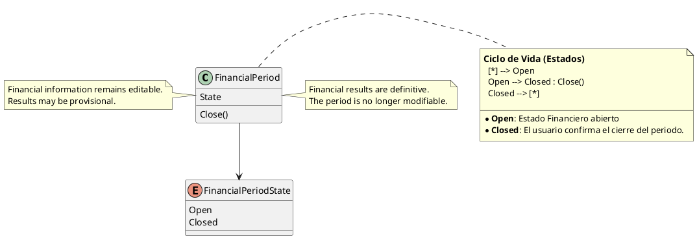

# FinancialPeriodState

## Purpose

`FinancialPeriodState` represents the current business state of a `FinancialPeriod`.

It determines whether the period remains available for financial planning and execution or whether its results have already been finalized.

The domain currently recognizes two states:

```text
Open
Closed
```

---

## Structure

| State | Meaning |
|-------|---------|
| Open | The financial period is active and its financial information can still be completed or adjusted. |
| Closed | The financial period has been manually finalized and its financial results are definitive. |

`FinancialPeriodState` is represented as a finite set of domain values rather than as an independently identifiable entity.

---

## Lifecycle

A financial period follows the lifecycle below:

```text
Open
  │
  │ Close()
  ▼
Closed
```

Every financial period starts in the `Open` state.

The transition to `Closed` is explicitly initiated by the user and can occur only when the aggregate satisfies the conditions required for closure.

The current domain model does not support reopening a closed financial period.

---

## Responsibilities

`FinancialPeriodState` is responsible for representing whether a financial period:

- remains available for financial execution;
- can still receive business changes;
- produces provisional or definitive financial results;
- can participate as a closed source period for definitive carry-forward operations.

The state itself does not perform the closure.

The `FinancialPeriod` Aggregate Root validates the business conditions and controls the transition.

---

## Business Rules

`FinancialPeriodState` participates in the enforcement of the following business rules:

- BR-002 — Every financial period starts in the Open state.
- BR-003 — A financial period is closed manually.
- BR-004 — Only Closed financial periods produce definitive balances.
- BR-006 — The transferred balance may be provisional.
- BR-022 — Business consistency is achieved when the financial period is closed.
- BR-023 — A financial period progresses through business states.

See [business rules ](../analysis/003-business-rules.md) for the complete rule definitions and domain responsibility matrix.

---

## Invariants

| Id | Invariant |
|----|-----------|
| INV-040 | A financial period must always have a valid state. |
| INV-041 | Every newly created financial period starts in the Open state. |
| INV-042 | A financial period can transition only from Open to Closed. |
| INV-043 | A Closed financial period cannot be modified. |
| INV-044 | Only a Closed financial period produces definitive financial results. |

---

## Closure Conditions

The transition from `Open` to `Closed` is controlled by `FinancialPeriod`.

Before closing the period, the aggregate must verify that:

- every expense has reached the `Entered` state;
- every income has reached the `Entered` state;
- the investment amount has been confirmed;
- all information required for business consistency has been completed.

```text
FinancialPeriod.Close()

    Validate expenses
    Validate income
    Validate investment
    Validate period consistency
              │
              ▼
         State = Closed
```

Failure to satisfy any closure condition prevents the transition.

---

## Notes

Closing a financial period is a manual business decision.

The system may determine whether the period is ready to close, but it must not close the period automatically.

An `Open` period can produce provisional balances. These balances may be used when generating or updating another financial period, but they are not definitive.

A `Closed` period produces definitive balances and cannot receive additional financial modifications.

The possibility of reopening a closed period is currently outside the defined domain behavior. It should not be introduced unless a concrete business requirement appears.

---

## UML


