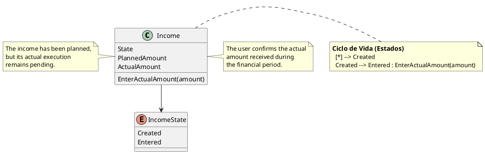

# IncomeState


## Purpose

`IncomeState` represents the current execution state of an `Income`.

It indicates whether the income has only been planned within the financial period or whether its actual amount has already been entered and confirmed by the user.

The domain recognizes two states:

```text
Created
Entered
```

---

## Structure

| State | Meaning |
|-------|---------|
| Created | The income exists in the financial period, but its actual amount has not yet been completed. |
| Entered | The user has entered and confirmed the actual amount of the income. |

`IncomeState` is a finite set of domain values and does not require an independent identity.

---

## Lifecycle

An income follows the lifecycle below:

```text
Created
   │
   │ EnterActualAmount()
   ▼
Entered
```

Every newly created income starts in the `Created` state.

The transition to `Entered` occurs when the user explicitly enters and confirms its actual amount.

The actual amount may be zero when the expected income was not received during the period.

---

## Responsibilities

`IncomeState` is responsible for representing whether an income:

- remains pending during the execution of the financial period;
- has had its actual amount completed;
- satisfies its lifecycle requirement for closing the financial period.

The state does not modify or validate the amount by itself.

The `Income` entity controls the transition and validates the actual amount before changing its state.

---

## Business Rules

`IncomeState` participates in the enforcement of the following business rules:

- BR-015 — Income does not contain detail records.
- BR-016 — The planned income of a new period is initialized from the actual income of the previous period.
- BR-021 — Planning and execution remain independent.
- BR-022 — Financial consistency must be achieved before closing the financial period.

See [business rules ](../analysis/003-business-rules.md) for the complete rule definitions and domain responsibility matrix.

---

## Invariants

| Id | Invariant |
|----|-----------|
| INV-050 | An income must always have a valid state. |
| INV-051 | Every newly created income starts in the Created state. |
| INV-052 | An income can transition only from Created to Entered. |
| INV-053 | The transition to Entered must be explicitly initiated by the user. |
| INV-054 | The income state cannot be inferred only from the value of its actual amount. |

---

## Entry Conditions

The transition from `Created` to `Entered` is controlled by the `Income` entity.

Before completing the transition, the income must validate that:

- the actual amount is valid;
- the value has been explicitly provided or confirmed;
- the income remains internally consistent.

```text
Income.EnterActualAmount(amount)

    Validate amount
    Assign actual amount
    Confirm execution
           │
           ▼
      State = Entered
```

Because an income does not contain detail records, its actual amount is entered directly into the entity.

---

## Notes

The `Entered` state means that the user considers the income execution complete.

It does not mean that the actual amount must be greater than zero.

For example, an expected income may not be received during the financial period. In that case, the user can confirm:

```text
ActualAmount = 0
State        = Entered
```

Therefore:

```text
ActualAmount = 0
```

does not necessarily imply:

```text
State = Created
```

Similarly, assigning an amount greater than zero should not automatically change the state unless the business operation explicitly confirms the income.

Planning and execution remain independent:

```text
PlannedAmount → Expected income
ActualAmount  → Income effectively received
IncomeState   → Whether execution has been confirmed
```

When a new financial period is generated:

```text
New.PlannedAmount = Previous.ActualAmount
New.ActualAmount  = 0
New.State         = Created
```

These are initialization rules and not permanent invariants.

---

## UML

