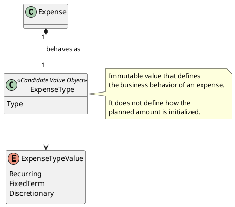

# ExpenseType

## Purpose

`ExpenseType` represents the business behavior of an expense.

It defines how an expense behaves across financial periods and how it participates in the generation of the next period.

`ExpenseType` does not identify what the expense represents. That responsibility belongs to `ExpenseCategory`.

```text
ExpenseCategory → What is the expense?
ExpenseType     → How does the expense behave?
```

---

## Structure

The domain currently recognizes three expense types:

```text
Recurring
Fixed-Term
Discretionary
```

Their expected behavior is:

| Type | Behavior |
|------|----------|
| Recurring | Continues into future financial periods without a predefined end date. |
| Fixed-Term | Continues only while its defined duration or installment sequence remains active. |
| Discretionary | Represents optional or individually recorded spending whose actual execution starts at zero in each new period. |

The final technical representation of `ExpenseType` remains pending. It may be implemented as an enumeration or as an immutable Value Object.

---

## Lifecycle

`ExpenseType` does not have an independent lifecycle.

It is an immutable value assigned to an `Expense`.

When the business behavior of an expense changes, the current type is replaced by another valid type.

```text
Current ExpenseType
        │
        │ Change behavior
        ▼
New ExpenseType
```

The `Expense` remains the same entity, while its behavior classification changes.

---

## Responsibilities

`ExpenseType` is responsible for defining:

- whether an expense continues into the next financial period;
- whether an expense has a limited duration;
- whether an expense must stop being carried forward after its term is completed;
- whether its detail records require specific business treatment;
- how the expense participates in period generation.

`ExpenseType` does not define:

- the business category of the expense;
- the planned or actual amount;
- how the planned amount is calculated or initialized;
- the lifecycle state of the expense;
- the complete period-generation process.

The generation of a new financial period is coordinated by `FinancialPeriod`, using the behavior represented by each expense type.

---

## Business Rules

`ExpenseType` participates in the enforcement of the following business rules:

- BR-013 — Expenses are classified according to business behavior.
- BR-019 — A new financial period starts from the previous one.
- BR-020 — Carry-forward behavior depends on the business concept.

The complete rules are defined in:

```text
docs/analysis/003-business-rules.md
```

---

## Invariants

| Id | Invariant |
|----|-----------|
| INV-035 | Every expense has exactly one valid expense type. |
| INV-036 | An expense type represents business behavior, not the meaning or category of the expense. |
| INV-037 | An expense type must be one of the types recognized by the domain. |
| INV-038 | An expense type is immutable. |
| INV-039 | Two expense types with the same value are considered equivalent. |

---

## Notes

`ExpenseType` is modeled as a candidate Value Object because:

- it does not require an independent identity;
- it is defined by its value;
- it can be immutable;
- two equal types represent the same business behavior;
- replacing the type does not replace the owning expense.

For example:

```text
Expense
Category: Electricity
Type:     Recurring
```

```text
Expense
Category: Laptop
Type:     Fixed-Term
```

```text
Expense
Category: Personal Expenses
Type:     Discretionary
```

The initialization of planned amounts is intentionally excluded from `ExpenseType`.

For example, obtaining a planned amount from the same month of the previous year, from the previous financial period, or from a manually entered value is a separate business concern.

A dedicated planning concept may be introduced later if the domain analysis demonstrates that it has enough independent behavior.

---

## UML


