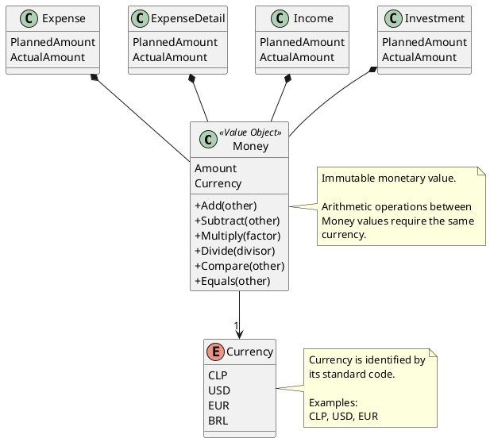

# Money

## Purpose

`Money` represents a monetary amount in a specific currency.

It provides a consistent representation for every financial value managed by the domain and prevents monetary operations between incompatible currencies.

Instead of exposing primitive numeric values throughout the domain, financial amounts are represented using `Money`.

```text
Money
├── Amount
└── Currency
```

---

## Structure

`Money` is composed of:

| Attribute | Description |
|-----------|-------------|
| Amount | Numeric monetary value. |
| Currency | Currency in which the amount is expressed. |

The currency is identified by its standard code.

Examples:

```text
Money
├── Amount: 150000
└── Currency: CLP
```

```text
Money
├── Amount: 250.50
└── Currency: USD
```

The domain may initially support currencies such as:

```text
CLP
USD
EUR
```

The definitive list of supported currencies is a configuration decision and is not hard-coded into the business meaning of `Money`.

---

## Lifecycle

`Money` does not have an independent lifecycle.

It is immutable.

Any arithmetic operation produces a new `Money` instance instead of modifying an existing one.

```text
Money(100000, CLP)
          +
Money(50000, CLP)
          │
          ▼
Money(150000, CLP)
```

---

## Responsibilities

`Money` is responsible for:

- representing an amount together with its currency;
- preserving monetary precision;
- validating monetary values;
- performing monetary arithmetic;
- comparing monetary values;
- determining monetary equality;
- preventing operations between incompatible currencies.

Typical operations include:

```text
Add()
Subtract()
Multiply()
Divide()
Compare()
Equals()
```

`Money` is not responsible for:

- obtaining exchange rates;
- converting between currencies;
- deciding the exchange rate to apply;
- formatting monetary values for presentation;
- applying localization rules.

Currency conversion, if introduced later, must be performed explicitly by a separate domain or application service.

---

## Business Rules

`Money` supports the implementation of the following business rules:

- BR-006 — Provisional transferred balance.
- BR-007 — Remaining balance transferred.
- BR-008 — Expense planned amount.
- BR-009 — Expense actual amount starts at zero.
- BR-011 — Expense actual amount is calculated from detail records.
- BR-012 — Planned amount remains independent from details.
- BR-015 — Income planned and actual amounts.
- BR-016 — New income planning uses the previous actual amount.
- BR-017 — Planned investment is calculated.
- BR-018 — Actual investment depends on execution.
- BR-021 — Planning and execution remain independent.

`Money` is a supporting Value Object and does not own these business rules directly.

The complete rules are defined in:

```text
docs/analysis/003-business-rules.md
```

---

## Invariants

| Id | Invariant |
|----|-----------|
| INV-055 | A Money instance must always contain a valid amount. |
| INV-056 | A Money instance must always contain a valid currency. |
| INV-057 | Money is immutable. |
| INV-058 | Two Money instances are equal only when both their amount and currency are equal. |
| INV-059 | Arithmetic operations between monetary values require compatible currencies. |
| INV-060 | Monetary operations always return a new Money instance. |
| INV-061 | Monetary calculations must preserve the precision required by the currency. |

---

## Monetary Operations

Addition and subtraction are valid only when both values use the same currency.

```text
Money(100000, CLP)
+
Money(50000, CLP)

Result:
Money(150000, CLP)
```

The following operation is invalid:

```text
Money(100000, CLP)
+
Money(200, USD)
```

The domain must reject this operation because no currency conversion has been explicitly performed.

Multiplication and division may use non-monetary numeric values:

```text
Money(10000, CLP) × 3

Result:
Money(30000, CLP)
```

Operations must not silently convert currencies.

---

## Notes

Every monetary value in the domain should use `Money`.

Examples include:

```text
Expense
├── PlannedAmount : Money
└── ActualAmount  : Money
```

```text
ExpenseDetail
├── PlannedAmount : Money?
└── ActualAmount  : Money
```

```text
Income
├── PlannedAmount : Money
└── ActualAmount  : Money
```

```text
Investment
├── PlannedAmount : Money
└── ActualAmount  : Money
```

```text
FinancialPeriod
├── RemainingBalance   : Money
└── TransferredBalance : Money
```

The domain supports the concept of multiple currencies, but that does not imply that amounts belonging to different currencies can be combined directly.

A `FinancialPeriod` will normally operate using one principal currency. The exact rule governing whether a period can contain more than one currency should be decided when multi-currency period behavior becomes part of the business requirements.

Currency symbols are not sufficient to identify a currency because different currencies may share the same symbol.

For that reason, monetary identity should rely on codes such as:

```text
CLP
USD
EUR
```

rather than only:

```text
$
€
```

---

## UML


