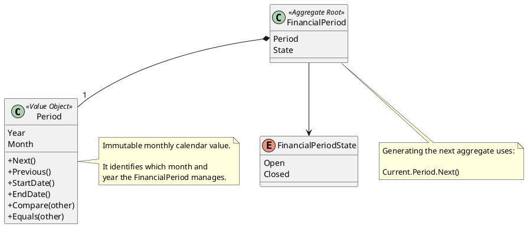

# Period

## Purpose

`Period` represents the calendar month and year managed by a `FinancialPeriod`.

It provides a precise domain representation for a monthly financial interval and prevents the use of incomplete or ambiguous date values.

Examples:

```text
July 2026
August 2026
January 2027
```

A `Period` identifies a calendar month. It does not represent the lifecycle state of the corresponding `FinancialPeriod`.

```text
Period               → Which month is being managed?
FinancialPeriodState → What is the current state of that month?
```

---

## Structure

`Period` is composed of:

| Attribute | Description |
|-----------|-------------|
| Year | Calendar year represented by the period. |
| Month | Calendar month represented by the period. |

```text
Period
├── Year
└── Month
```

Example:

```text
Period
├── Year: 2026
└── Month: 7
```

This represents:

```text
July 2026
```

The internal month representation may use a numeric value or a domain enumeration, provided that only valid calendar months can be represented.

---

## Lifecycle

`Period` does not have an independent lifecycle.

It is immutable.

A period does not change from one month to another. Generating the next period creates a new value.

```text
Period(2026, July)
          │
          │ Next()
          ▼
Period(2026, August)
```

The transition between December and January must update the year correctly.

```text
Period(2026, December)
          │
          │ Next()
          ▼
Period(2027, January)
```

---

## Responsibilities

`Period` is responsible for:

- representing a valid calendar month and year;
- preventing invalid monthly periods;
- comparing periods chronologically;
- determining equality between periods;
- calculating the previous period;
- calculating the next period;
- exposing the first and last calendar dates of the represented month when required.

Typical operations include:

```text
Next()
Previous()
Compare()
Equals()
StartDate()
EndDate()
```

`Period` is not responsible for:

- opening or closing a financial period;
- determining whether a period can be generated;
- copying expenses or income;
- transferring balances;
- validating financial information;
- calculating planned or actual amounts.

Those responsibilities belong to `FinancialPeriod`.

---

## Business Rules

`Period` supports the implementation of the following business rules:

- BR-001 — Financial information is organized into monthly periods.
- BR-005 — Multiple financial periods may coexist.
- BR-019 — A new financial period starts from the previous one.
- BR-020 — Carry-forward behavior depends on the business concept.

`Period` provides the temporal representation required by these rules, while `FinancialPeriod` coordinates their execution.

The complete rules are defined in:

```text
docs/analysis/003-business-rules.md
```

---

## Invariants

| Id | Invariant |
|----|-----------|
| INV-062 | A Period must always contain a valid year. |
| INV-063 | A Period must always contain a valid calendar month. |
| INV-064 | Period is immutable. |
| INV-065 | Two Period instances are equal when they represent the same month and year. |
| INV-066 | The next period must be chronologically consecutive to the current period. |
| INV-067 | The previous period must be chronologically consecutive before the current period. |
| INV-068 | A FinancialPeriod must be uniquely identified by its Period within the same user or financial context. |

---

## Period Navigation

The next period is calculated according to the calendar.

```text
Next(Period(2026, July))
=
Period(2026, August)
```

For the end of the year:

```text
Next(Period(2026, December))
=
Period(2027, January)
```

The previous period follows the inverse behavior:

```text
Previous(Period(2026, January))
=
Period(2025, December)
```

These operations create new values and do not modify the original `Period`.

---

## Date Boundaries

`Period` may expose its calendar boundaries when required by domain operations.

Example:

```text
Period: July 2026

StartDate: 2026-07-01
EndDate:   2026-07-31
```

These boundaries may be used for validations such as:

- determining whether an expense detail date belongs to the financial period;
- initializing dates when detail descriptions are carried forward;
- validating the date from which the next financial period can be generated.

The period itself only provides the boundaries. The owning entity decides how to use them.

---

## Notes

`Period` is modeled as a Value Object because:

- it does not require an independent identity;
- it is defined by its month and year;
- it is immutable;
- two periods representing the same month and year are equivalent;
- changing the month creates a different period value.

A plain date should not replace `Period`.

For example:

```text
2026-07-15
```

represents a specific day, while:

```text
Period(2026, July)
```

represents the complete financial month.

`Period` must also remain separate from `FinancialPeriodState`.

For example, the same calendar period may be:

```text
Period: July 2026
State:  Open
```

and later:

```text
Period: July 2026
State:  Closed
```

The `Period` value has not changed. Only the lifecycle state of the aggregate has changed.

When generating a new financial period:

```text
NewFinancialPeriod.Period =
    PreviousFinancialPeriod.Period.Next()
```

This determines the temporal identity of the new aggregate but does not perform the carry-forward process itself.

---

## UML



