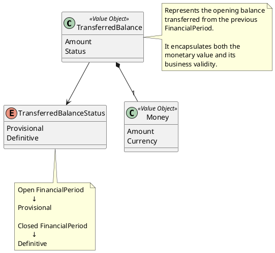

# TransferredBalance

## Purpose

`TransferredBalance` represents the opening financial balance transferred from
one `FinancialPeriod` to the next.

It encapsulates both the monetary amount and its business validity, allowing the
domain to distinguish between provisional and definitive transferred balances.

Unlike a simple monetary value, a transferred balance expresses business
meaning rather than numerical information alone.

---

## Structure

`TransferredBalance` is composed of the following elements:

- Amount (`Money`)
- Status (`TransferredBalanceStatus`)

```text
TransferredBalance
├── Amount: Money
└── Status: TransferredBalanceStatus
```

---

## Lifecycle

A transferred balance is immutable.

Its lifecycle is determined by the lifecycle state of the source
`FinancialPeriod`.

```text
FinancialPeriod (Open)
        │
        ▼
TransferredBalance
Status = Provisional
```

After the source period is closed:

```text
FinancialPeriod (Closed)
        │
        ▼
TransferredBalance
Status = Definitive
```

A definitive transferred balance represents the final opening balance of the
following financial period.

---

## Responsibilities

`TransferredBalance` is responsible for:

- representing the opening balance transferred between financial periods;
- preserving the transferred monetary amount;
- indicating whether the transferred balance is provisional or definitive;
- expressing the business meaning of the transferred balance;
- remaining immutable after creation.

`TransferredBalance` is **not** responsible for:

- calculating the remaining balance;
- determining its own status;
- updating itself when the source period changes.

Those responsibilities belong to the surrounding domain workflow.

---

## Business Rules

This Value Object participates in the following business rules:

| Rule | Description |
|------|-------------|
| BR-006 | The transferred balance may be provisional. |
| BR-007 | The remaining balance is transferred to the next financial period. |
| BR-019 | A new financial period starts from the previous one. |
| BR-020 | Carry-forward behavior depends on the business concept. |

---

## Invariants

The following invariants always hold.

| Id | Invariant |
|----|-----------|
| INV-TB-001 | A transferred balance always contains a valid monetary amount. |
| INV-TB-002 | A transferred balance always has a valid status. |
| INV-TB-003 | A definitive transferred balance cannot become provisional. |

---

## Notes

`TransferredBalance` is a Value Object because:

- it has no identity;
- it is defined entirely by its values;
- it is immutable;
- two transferred balances with the same amount and status are considered equal.

This Value Object prevents the domain from representing the opening balance as a
simple `Money` together with an unrelated boolean flag.

Instead, it models a business concept directly expressed in the ubiquitous
language.

---

## UML

