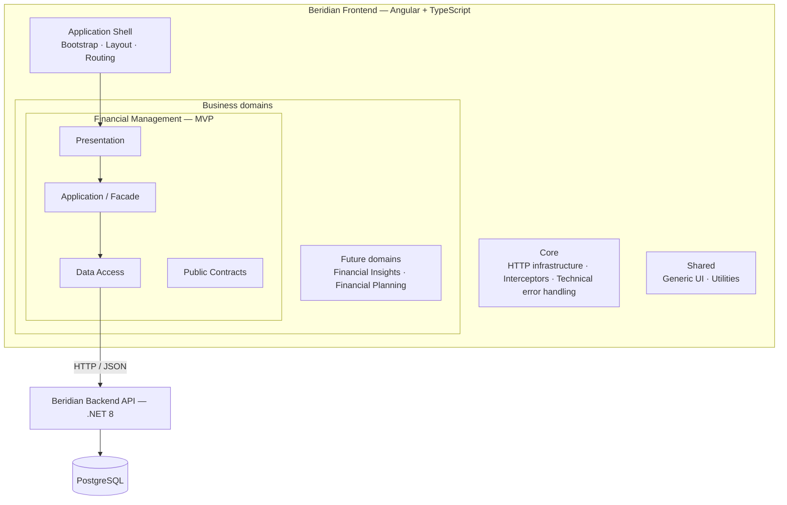
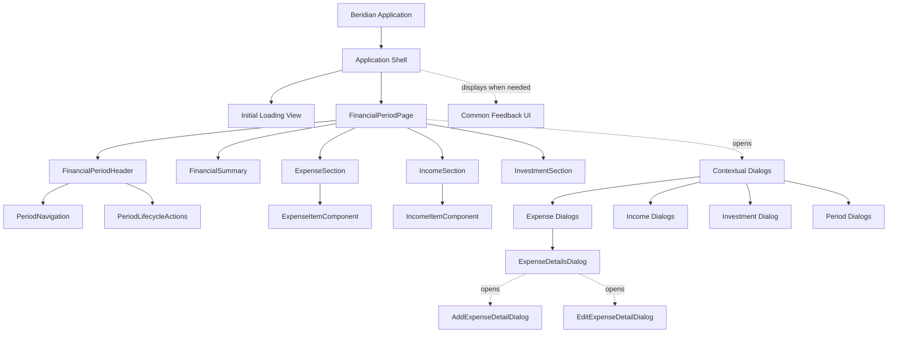

# Beridian — Frontend Architecture

**Version:** 0.2 — Initial Component Hierarchy  
**Status:** Draft — high-level architecture and initial component hierarchy approved; remaining detailed design pending  
**Sprint:** 3 — Financial Period Experience  
**Session:** 003 — Frontend Architecture and API Contract Review

## 1. Purpose

Document the approved frontend architectural decisions for the Beridian MVP and provide an evolving reference for subsequent design tasks. This document is developed incrementally; items marked *Pending* are not yet approved decisions.

## 2. Scope

The MVP frontend supports the Financial Period user flows and interacts with the existing Beridian .NET 8 API. This version defines high-level structure, responsibilities, and the **approved initial component hierarchy**. TypeScript models, service contracts, state ownership, and implementation remain pending.

No frontend code is implemented as part of this design activity.

## 3. Approved decisions

| Area | Decision |
|---|---|
| Framework | Angular |
| Language | TypeScript |
| Primary organization | Domain-based |
| Organization within domains | Feature-based where appropriate |
| Deployment architecture for MVP | Modular monolith: one Angular application |
| Cross-domain interaction | Explicit public capabilities/contracts; internal implementation remains encapsulated |
| Internal responsibility separation | Presentation → Application / Facade → Data Access |
| Business invariants | Enforced by the .NET backend/domain |
| API errors | Frontend handling compatible with backend RFC 7807 responses |
| Microfrontends | Future evaluation only; not implemented in the MVP |

## 4. Architectural overview

This is a **logical overview**, not a complete dependency graph. `Financial Insights` and `Financial Planning` are possible future domain areas, not implemented MVP modules. The placement of `Public Contracts` is conceptual; exact exports and interfaces remain to be designed.

## 5. Responsibilities

### 5.1 Presentation

Owns rendering, user interactions, forms, and user-facing feedback. It should not implement HTTP integration or duplicate backend domain invariants.

### 5.2 Application / Facade

Coordinates UI operations, loading and error states, and communication with Data Access. A facade is used when coordination warrants it; it is **not** mandatory for every small component. It does not reproduce backend use cases or business invariants.

### 5.3 Data Access

Encapsulates HTTP calls, API DTOs, and necessary mapping/adaptation between transport data and frontend-facing models.

### 5.4 Core

Holds application-wide technical infrastructure, such as HTTP interceptors and cross-cutting technical error handling. It should not become a repository of business-specific logic.

### 5.5 Shared

Holds genuinely reusable, domain-agnostic UI elements and utilities. Sharing should be justified rather than automatic.

### 5.6 Public domain contracts

Domains keep internal implementation details private and expose explicitly selected capabilities to other domains when a justified business dependency exists. Public TypeScript interfaces alone do not enforce runtime isolation or provide Angular dependency injection; where needed, DI requires a runtime token/provider. Import boundaries can later be enforced with tooling.

## 6. Validation and error handling

| Concern | Primary responsibility |
|---|---|
| Required fields, input formats, form feedback | Presentation; reusable validators where appropriate |
| Loading and operation coordination | Application / Facade |
| HTTP/network details | Data Access and shared technical handling in Core |
| User-visible error messages | Presentation, potentially coordinated by Facade |
| Business-rule validation and invariants | Backend |
| RFC 7807 problem responses | Technical interpretation in Data Access/Core; contextual display in Presentation |

Frontend affordances, such as disabling a Close button when pending items are known, do not replace backend enforcement of Financial Period closing rules.

## 7. Modularity and possible microfrontend evolution

The MVP remains a single Angular application organized into bounded business domains. Clear domain boundaries, explicit public contracts, controlled state sharing, and domain-oriented routing may make future extraction easier.

**No shell federation, independent frontend deployment, Module Federation, or Native Federation is required for the MVP.** Microfrontends may be evaluated later if independently deployable domains or team autonomy justify the operational costs. Extraction is not guaranteed to be automatic: runtime integration, authentication, versioning, shared dependencies, and communication must be designed separately.

## 8. Architectural guidelines

- Prefer high cohesion and low coupling.
- Keep domain implementations encapsulated.
- Avoid direct imports into another domain's internal implementation.
- Use public domain contracts only where a cross-domain dependency is justified.
- Do not introduce interfaces, facades, or abstractions solely for ceremony.
- Prefer composition and clear responsibilities over unnecessary inheritance.
- Preserve backend authority over business rules and persistence.

These are approved **high-level guidelines**; enforceable dependency rules and a detailed dependency diagram are deferred to the dedicated task.

## 9. Initial component hierarchy (approved)

### 9.1 Design basis and scope

The Financial Period Dashboard is the **single main navigable page** for the MVP. Open, closed/historical, empty, and generated Financial Periods are **states of that page**, not separate pages. Navigation changes the displayed period; lifecycle operations (closing and generation) are distinct actions. The hierarchy below describes UI responsibilities and functional groupings; it is **not** a prescribed Angular folder structure, component selector list, or dependency-injection design.

This design is based on the approved UX specifications: `screen-map.md`, `financial-period-dashboard.md`, `expense-interactions.md`, `income-interactions.md`, `investment-interactions.md`, `period-lifecycle-interactions.md`, and `interface-states.md`.

### 9.2 Component hierarchy

Solid arrows indicate **proposed visual composition**; dashed arrows indicate **functional use/opening**, not a required Angular parent-child relationship. The diagram intentionally groups most dialogs to keep the hierarchy legible. The complete dialog inventory follows.

### 9.3 Component responsibilities

| Component / group | Responsibility |
|---|---|
| `ApplicationShell` | Hosts the application entry experience and the main routed view; does not implement financial business rules. |
| `InitialLoadingView` | Communicates initialization/synchronization progress before a confirmed Financial Period can be displayed. |
| `FinancialPeriodPage` | Composes the dashboard, reflects the selected period and its state, and provides access to contextual operations. |
| `FinancialPeriodHeader` | Displays the selected month/year and period status, and groups navigation and lifecycle controls. |
| `PeriodNavigation` | Offers Previous, Next, Search, and Current actions; never generates missing periods. |
| `PeriodLifecycleActions` | Exposes Close Period and Generate Period when applicable. |
| `FinancialSummary` | Presents opening/transferred balance, planned/actual income, and planned/actual remaining balances; does not calculate domain values. |
| `ExpenseSection` | Presents the expense collection, empty state, and Add Expense entry point. |
| `ExpenseItemComponent` | Presents one expense's description, planned/actual amounts, and contextual confirmation/details action. |
| `IncomeSection` | Presents the income collection, empty state, and Add Income entry point. |
| `IncomeItemComponent` | Presents one income's description, planned/actual amounts, and contextual confirmation action. |
| `InvestmentSection` | Presents planned and actual investment and the contextual confirmation action; planned amount is read-only. |
| Common feedback UI | Displays domain or technical error feedback; input validation is displayed near affected form fields. |

`ExpenseItemComponent` and `IncomeItemComponent` are **explicitly approved** as separate item components. Further decomposition of labels, amounts, buttons, and fields is not required unless justified during implementation.

### 9.4 Contextual dialog inventory

| Functional area | Dialog | Purpose |
|---|---|---|
| Expense | `AddExpenseDialog` | Create a planned expense of a supported variant. |
| Expense | `ConfirmExpenseDialog` | Enter the actual amount for an expense without details. |
| Expense | `ExpenseDetailsDialog` | View/manage details and confirm an expense using its details; read-only consultation when closed. |
| Expense | `AddExpenseDetailDialog` | Add a detail to the selected expense. |
| Expense | `EditExpenseDetailDialog` | Edit an existing expense detail. |
| Income | `AddIncomeDialog` | Create a planned income. |
| Income | `ConfirmIncomeDialog` | Enter the actual income amount. |
| Investment | `ConfirmInvestmentDialog` | Confirm actual investment, showing planned and available amounts for reference. |
| Period navigation | `SearchFinancialPeriodDialog` | Select year and period and navigate to an existing Financial Period. |
| Period lifecycle | `CloseFinancialPeriodDialog` | Review the final summary and irreversible-close warning before confirmation. |
| Period lifecycle | `GenerateFinancialPeriodDialog` | Review source/next period and confirm manual generation. |

These **eleven functional dialogs** correspond to the approved Screen Map. Domain-error and technical-error feedback are common interface patterns, not additional financial operations. Removal of an expense detail is an action within `ExpenseDetailsDialog`; the current UX specification does **not** define a separate Remove Detail dialog.

### 9.5 Interaction and state constraints

- Initial loading completes before displaying a usable Financial Period; an incomplete or unconfirmed period is not presented as available.
- Open, closed/historical, empty, and generated periods reuse `FinancialPeriodPage`; a closed period is consultative, with financial modifications unavailable while navigation and expense-detail consultation remain available.
- Successful mutations retrieve the updated Financial Period and refresh the relevant dashboard sections and summary. Closing retains the same selected period; successful manual generation displays the newly generated period.
- Expense confirmation without details uses `ConfirmExpenseDialog`; expenses with details are confirmed through `ExpenseDetailsDialog`. The actual amount derived from details is governed by the backend.
- Form validation preserves the active dialog and entered values; domain/technical failures do not assume a successful mutation. Retry is offered only when appropriate.
- Dialog ownership, opening mechanisms, precise input/output contracts, model types, state ownership, and orchestration services will be defined in subsequent design tasks. The hierarchy does not imply that all dialogs are permanently rendered children of the page.

## 10. Pending design work

| Session task | Pending output |
|---|---|
| Define initial component hierarchy | **Completed — approved; documented in Section 9** |
| Define frontend models and services | TypeScript model/DTO/service responsibilities and contracts |
| Define state ownership and boundaries | Local, feature, and shared state decisions; selected Angular state mechanisms |
| Define dependency boundaries | Precise allowed/forbidden dependencies and dependency diagram |
| Document architectural decisions | Consolidated architecture document and ADRs |
| Validate architecture against user flows | Traceability and validation against agreed Financial Period flows |

## Appendix A — Frontend organization strategies

### A.1 Comparison

| Strategy | Description | Advantages | Disadvantages |
|---|---|---|---|
| Layer-based | Groups code by technical type (components, services, models). | Easy to start; familiar structure for small applications. | A feature can be scattered across many folders; coordination becomes harder as the application grows. |
| Feature-based | Groups code by user-facing capability. | Localizes related changes; supports feature ownership and maintenance. | Poorly defined feature boundaries can cause cross-feature coupling or duplication. |
| Domain-based | Groups related features within broader business areas. | Aligns code with business boundaries; supports expansion into new business capabilities. | Domain boundaries require deliberate design; can add hierarchy without benefit in small apps. |
| Clean / Hexagonal | Structures dependency direction and separates core behavior from adapters/framework details. | Helps isolate complex application logic and technical dependencies; improves testability when warranted. | Can introduce unnecessary indirection and boilerplate in a UI-focused MVP. |

**Note:** Clean/Hexagonal is primarily an architectural/dependency style, not a mutually exclusive folder organization. Domain-based and feature-based can be combined.

### A.2 Selection criteria

| Characteristic | Typical consideration |
|---|---|
| Small, simple application | Layer-based may be sufficient. |
| Multiple independent features | Feature-based often keeps related code together. |
| Multiple business areas/subdomains | Domain-based provides business-oriented grouping. |
| Complex frontend application logic and technology isolation | Clean/Hexagonal techniques may be worthwhile. |
| Multiple teams working independently | Explicit feature/domain boundaries can support ownership. |
| Expected incremental growth | Feature-based or domain-based structures can help, provided boundaries remain coherent. |

These are design heuristics, not universal rules. No folder organization guarantees scalability by itself.

### A.3 Beridian rationale

Beridian selects **domain-based organization**, with features inside domains as appropriate, because the planned product may expand beyond Financial Period management into distinct financial capabilities. A modular monolith avoids premature distributed-frontend complexity. The selected structure does not imply duplicating the backend DDD model in Angular or creating one frontend domain for every backend entity.

## Appendix B — ADR candidates (not yet authored)

1. Frontend stack and domain-based modular organization, including public domain contracts.
2. Modular-monolith-first strategy and deferred microfrontend adoption.

ADRs will be prepared during **Document architectural decisions**, after the remaining detailed design tasks are reviewed.
