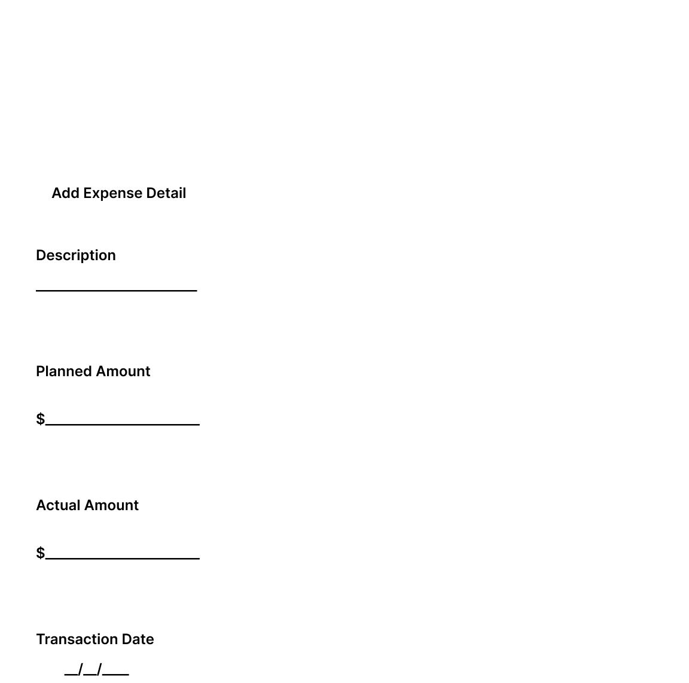
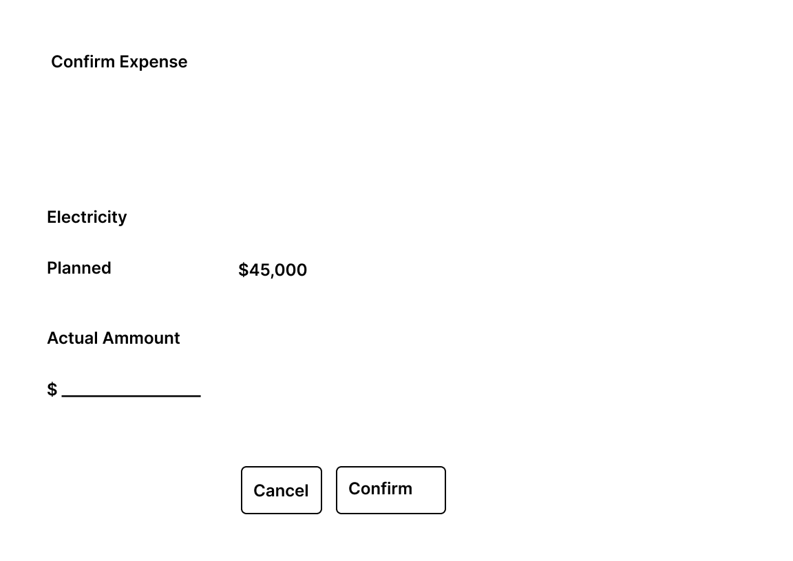
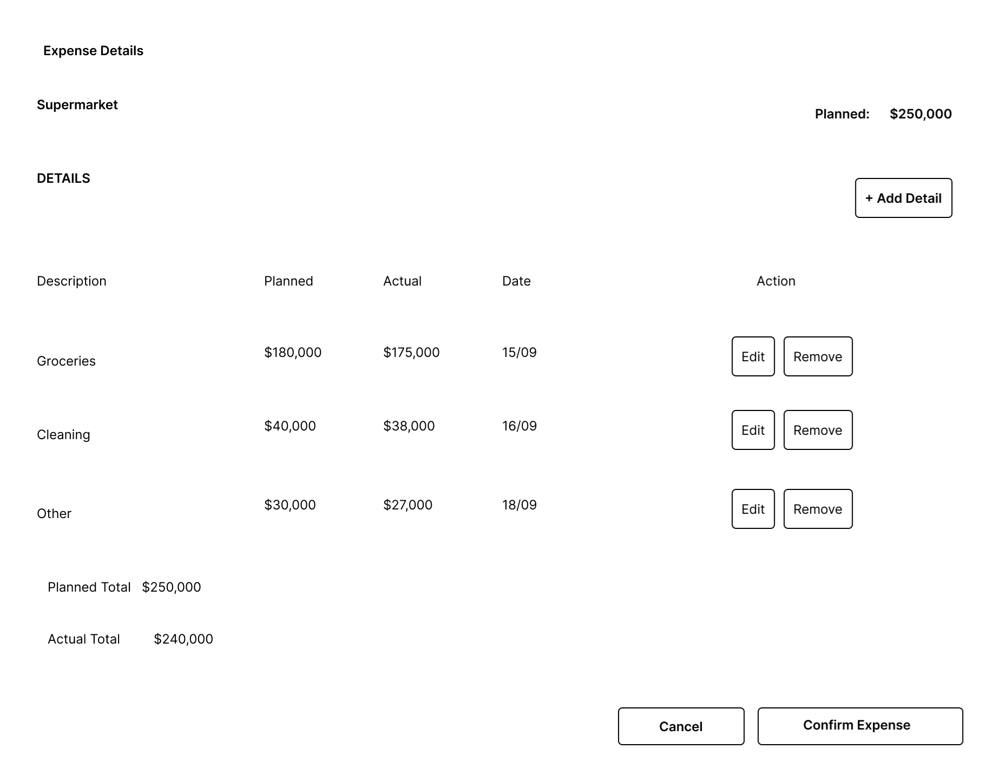
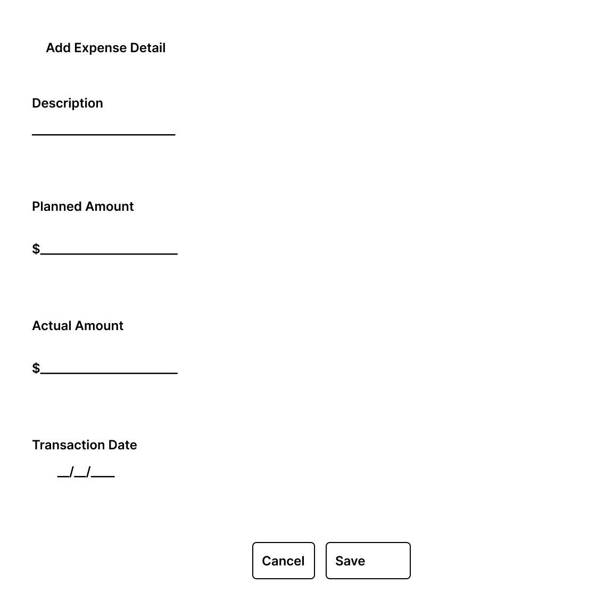

# Expense Interactions

## Purpose

Define the user interactions related to expense management within a Financial Period.

Expense interactions allow the user to:

- Add planned expenses to an open financial period.
- Enter the actual amount of an expense without details.
- Manage expense details when an expense uses detailed entries.
- Confirm an expense using its details.
- Review expense information from the Financial Period Dashboard.

The wireframes included in this document are versioned visual references for the supported MVP interactions.

---

## Expense Representation

Expenses are displayed as part of the Financial Period Dashboard.

Each expense presents:

- Description.
- Planned amount.
- Actual amount.
- Contextual action.

The available interaction depends on the expense configuration and its current state.

An expense may be managed:

- Directly, using a simple expense confirmation.
- Through expense details, when detailed entries are used.

Expense operations are available only when allowed by the current financial period and expense state.

---

## Expense Variants

The domain represents different expense behaviors through specialized expense classes.

The supported variants are:

- **Recurring Expense** — represents an expense that can continue across financial periods.
- **Fixed-Term Expense** — represents an expense with a defined number of installments.
- **Discretionary Expense** — represents personal or discretionary spending associated with the period.

The interface must reflect the information required by each supported variant without introducing a separate expense-type model outside the domain.

---

# Add Expense

## Purpose

The Add Expense interaction allows the user to create a planned expense within an open financial period.

The interaction is started from **Add Expense** in the Expense section of the Financial Period Dashboard.

The information requested by the interaction depends on the selected expense variant and the data required by that variant.

The actual amount is not entered as part of the initial expense creation.

## Actions

### Save

When the user selects **Save**:

1. The entered information is validated.
2. The application attempts to add the expense to the selected financial period.
3. If the operation succeeds, the modal is closed.
4. The updated financial period is retrieved.
5. The dashboard is refreshed.

The refreshed dashboard reflects the new expense and any resulting changes to the financial summary.

### Cancel

**Cancel** closes the modal without creating an expense or modifying the financial period.

## Wireframe

---

# Confirm Expense

## Purpose

The Confirm Expense interaction allows the user to enter the actual amount for an expense that is managed without detailed entries.

The interaction is started from the contextual confirmation action associated with the expense.

## Information Presented

The modal identifies the selected expense and displays:

- Expense description.
- Planned amount.

## Input

The user provides:

- **Actual Amount**

The planned amount is presented as reference information and is not modified during confirmation.

## Actions

### Confirm

When the user selects **Confirm**:

1. The entered actual amount is validated.
2. The application attempts to enter the actual expense.
3. If the operation succeeds, the modal is closed.
4. The updated financial period is retrieved.
5. The dashboard is refreshed.

The refreshed dashboard reflects the actual expense and any resulting changes to the financial summary.

### Cancel

**Cancel** closes the modal without modifying the expense or financial period.

## Wireframe

---

# Expense Details

## Purpose

The Expense Details interaction provides a detailed view of an expense that is managed using individual entries.

It allows the user to review the composition of the expense and perform supported detail operations.

## Information Presented

The interaction identifies the selected expense and displays its details.

Each detail presents:

- Description.
- Planned amount.
- Actual amount.
- Transaction date when available.
- Contextual actions when applicable.

The expense planned and actual amounts remain part of the financial period representation while the detail interaction provides the breakdown used to manage the expense.

## Available Actions

For an open financial period, supported actions include:

- **Add Detail**
- **Edit Detail**
- **Remove Detail**
- **Confirm Expense**

The availability of each operation must reflect the current domain and application state.

For a closed financial period, details remain available for consultation but modification operations are unavailable.

## Wireframe

---

# Add Expense Detail

## Purpose

The Add Expense Detail interaction allows the user to add a detailed entry to an expense that supports details.

## Input

The user provides:

- **Description**
- **Planned Amount**
- **Actual Amount**
- **Transaction Date**

## Actions

### Save

When the user selects **Save**:

1. The entered information is validated.
2. The application attempts to add the detail to the selected expense.
3. If the operation succeeds, the detail modal is closed.
4. The expense information is refreshed.
5. The Expense Details view reflects the newly added detail.

### Cancel

**Cancel** closes the modal without adding a detail.

## Wireframe

---

# Edit Expense Detail

## Purpose

The Edit Expense Detail interaction allows the user to modify an existing detail belonging to an expense.

## Information Presented

The interaction displays the current values of the selected detail.

The editable information corresponds to:

- **Description**
- **Planned Amount**
- **Actual Amount**
- **Transaction Date**

## Actions

### Save

When the user selects **Save**:

1. The modified information is validated.
2. The application attempts to update the selected detail.
3. If the operation succeeds, the detail modal is closed.
4. The expense information is refreshed.
5. The Expense Details view reflects the updated values.

### Cancel

**Cancel** closes the modal without modifying the detail.

## Wireframe

---

# Expense Confirmation Using Details

When an expense is managed through details, confirmation is performed from the Expense Details interaction rather than through the simple Confirm Expense interaction.
The detail entries provide the information used by the expense confirmation operation.

After successful confirmation:

1. The Expense Details interaction is completed.
2. The updated financial period is retrieved.
3. The dashboard is refreshed.
4. The expense actual amount reflects the confirmed state.
5. The Financial Summary reflects the updated financial position.

The exact calculation and validation rules remain responsibilities of the domain and application layers.

The actual expense amount is obtained from the sum of its expense details.

After the details are entered or modified, the Expense Details view and the Financial Period Dashboard reflect the resulting actual expense amount.

---

# Remove Expense Detail

When removal is available, the user can remove an existing detail from an expense.

After successful removal:

- The detail is removed from the expense.
- The Expense Details view is refreshed.
- Financial information affected by the operation reflects the updated expense state.

The interface must not independently reproduce domain validation rules for detail removal.

---

# Interaction States

## Successful Operation

After a successful expense operation:

- The corresponding interaction is completed.
- Updated financial information is retrieved.
- The Expense section is refreshed.
- The Financial Summary is refreshed when affected.
- Available actions reflect the resulting state.

The user remains within the Financial Period experience.

---

## Input Validation Error

If required or invalid input prevents an operation from being submitted:

- The active modal remains open.
- The affected field is identified.
- A validation message is displayed near the corresponding field.
- Previously entered valid information is preserved.

No successful financial modification is assumed.

---

## Domain Rejection

If an expense operation is rejected by a business rule:

- No successful financial modification is assumed.
- The user receives domain-level feedback.
- The interface remains in a consistent state.

Domain feedback follows the common interface feedback pattern defined in `interface-states.md`.

---

## Technical Failure

If an expense operation cannot be completed because of a technical failure:

- No successful modification is assumed.
- The user receives technical failure feedback.
- The current financial period remains available.

Technical failure feedback follows the common interface feedback pattern defined in `interface-states.md`.

---

# Closed Financial Period

Expense modification operations are not available when the selected financial period is closed.

Existing expense information and details remain available for consultation, but creation, confirmation, editing, and removal operations are unavailable.

Period navigation remains available.

---

## Design Source

The wireframes included in this document are versioned artifacts of the MVP interaction design.

The Markdown specification and the versioned wireframes together define the Expense interaction reference for frontend implementation.

---

## Related Documents

- `financial-period-dashboard.md`
- `screen-map.md`
- `income-interactions.md`
- `interface-states.md`
- `period-lifecycle-interactions.md`

Related functional flow:

- UF-002 — Monthly Financial Period Management.