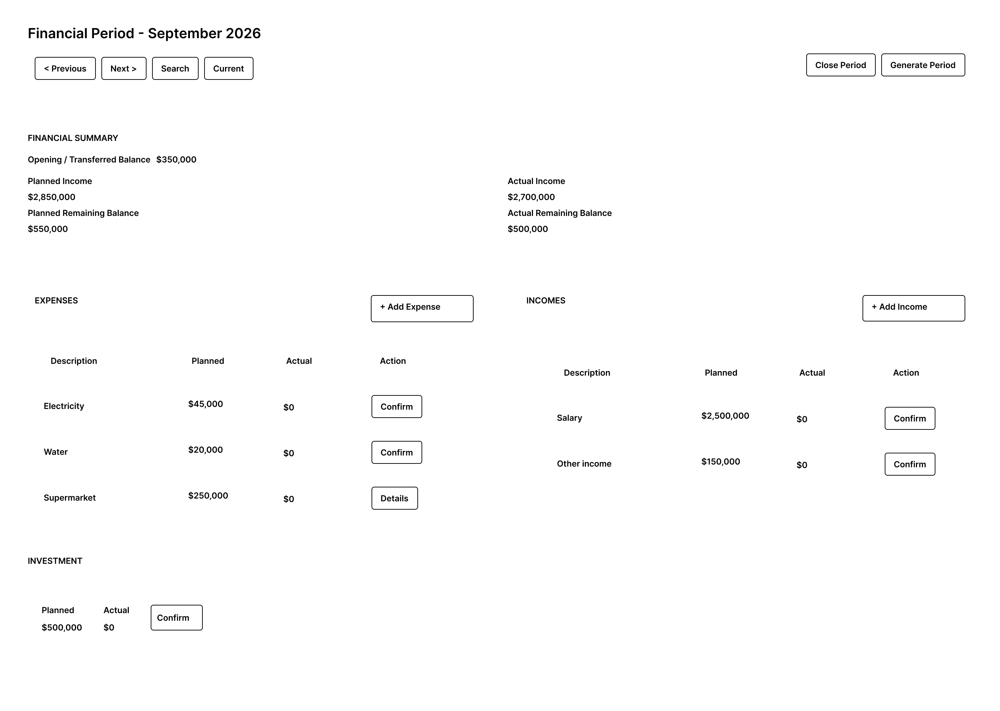
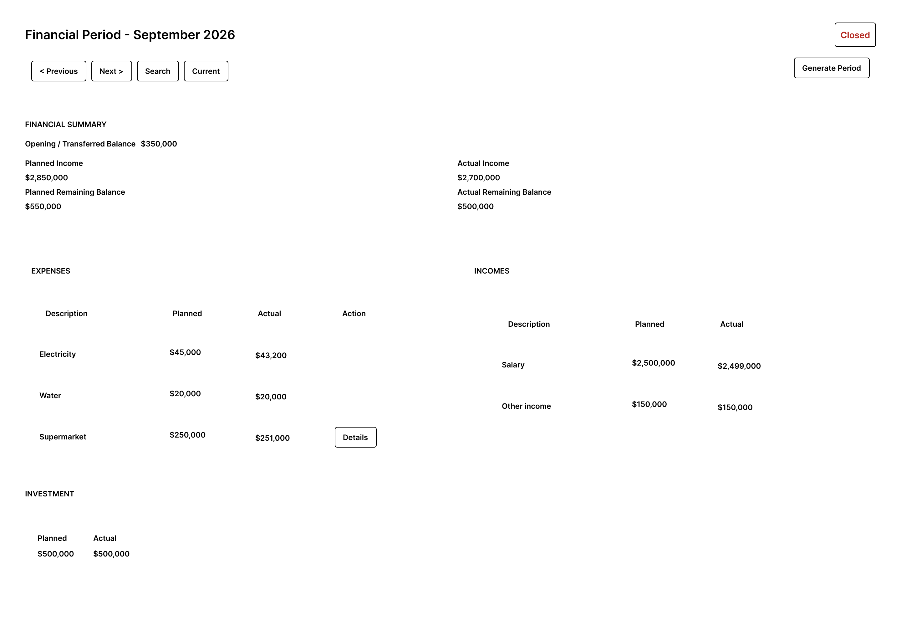
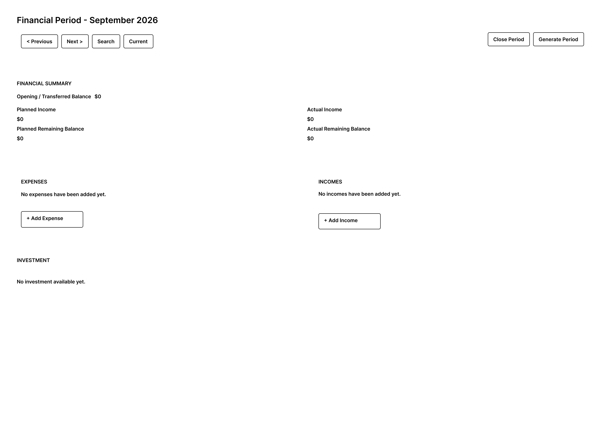
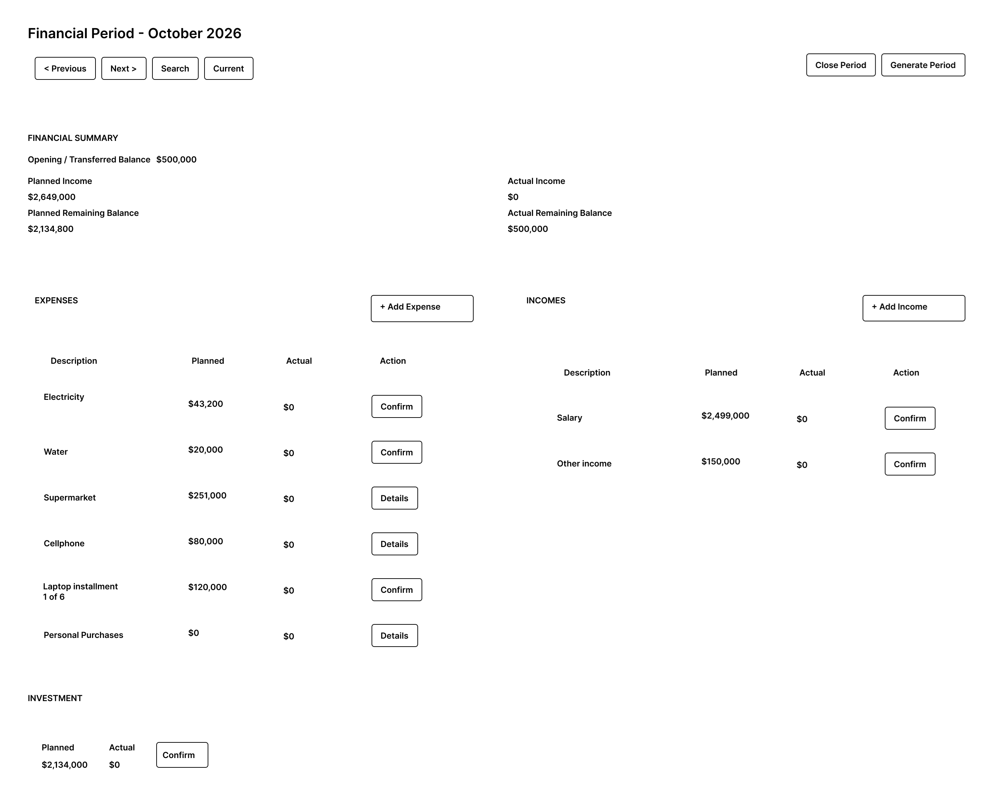

# Financial Period Dashboard

## Purpose

Define the main financial statement screen of the Beridian MVP.

The Financial Period Dashboard provides a unified view of the financial information for a selected period and acts as the main interaction surface for income, expense, investment, navigation, and period lifecycle operations.

This document defines the screen responsibilities, layout, and supported interface states.

---

## Screen Responsibilities

The dashboard is responsible for:

- Identifying the selected financial period.
- Displaying the financial period status.
- Providing period navigation.
- Displaying the financial summary.
- Displaying planned and actual expenses.
- Displaying planned and actual incomes.
- Displaying planned and actual investment.
- Providing access to financial operations.
- Providing access to period lifecycle operations.
- Adapting available actions according to the financial period state.

The dashboard does not implement financial rules itself.

Financial values and operation availability must reflect the state provided by the application and domain layers.

---

## Layout

The dashboard follows the financial statement layout defined for the MVP:

1. Header and period navigation.
2. Financial summary.
3. Expenses on the left and incomes on the right.
4. Investment below the expense and income sections.

The wireframes in this document are the visual reference for the MVP screen structure and interaction placement.

---

## Header

The header identifies the displayed financial period.

It contains:

- Month and year.
- Financial period status when relevant.
- Period navigation.
- Period lifecycle actions.

### Period Navigation

The following navigation actions are available:

- **Previous** — displays the previous available financial period.
- **Next** — displays the next available financial period.
- **Search** — opens the financial period search interaction.
- **Current** — returns directly to the financial period corresponding to the current month.

Navigation changes the displayed period but does not modify financial information.

### Period Lifecycle Actions

Depending on the selected financial period and the available operation:

- **Close Period** starts the financial period closing interaction.
- **Generate Period** starts generation of the immediately following financial period.

Detailed lifecycle behavior is defined in `period-lifecycle-interactions.md`.

---

## Financial Summary

The Financial Summary provides a compact view of the financial position of the selected period.

It displays:

- **Opening / Transferred Balance**
- **Planned Income**
- **Planned Remaining Balance**
- **Actual Income**
- **Actual Remaining Balance**

### Planned Information

Planned values represent the expected financial position of the period.

The planned remaining balance reflects the planned financial state after considering planned income, planned expenses, planned investment, and the opening balance.

### Actual Information

Actual values represent confirmed financial activity.

The actual remaining balance reflects the financial state using actual income, actual expenses, actual investment, and the opening balance.

The dashboard displays these values but does not calculate or redefine their business meaning.

---

## Expense Section

The Expense section displays the expenses belonging to the selected financial period.

Each expense displays:

- Description.
- Planned amount.
- Actual amount.
- Contextual action.

Depending on the expense configuration and state, the contextual action can provide access to:

- Actual expense confirmation.
- Expense details.

When the financial period is open, the section provides **Add Expense**.

Detailed behavior is defined in `expense-interactions.md`.

---

## Income Section

The Income section displays the incomes belonging to the selected financial period.

Each income displays:

- Description.
- Planned amount.
- Actual amount.
- Contextual action when applicable.

When the financial period is open:

- **Add Income** allows creation of a planned income.
- **Confirm** allows entry of the actual amount of an existing income.

Detailed behavior is defined in `income-interactions.md`.

---

## Investment Section

The Investment section displays:

- Planned investment.
- Actual investment.
- Contextual confirmation action when available.

The planned amount is presented as financial information and is not directly edited from the dashboard.

The actual amount can be entered through the investment confirmation interaction when the operation is available.

Detailed behavior is defined in `investment-interactions.md`.

---

# Dashboard States

## Open Financial Period

The Open Financial Period is the primary operational state of the dashboard.

The user can review planned and actual financial information and perform the financial operations currently allowed by the period and entity states.

Applicable creation and confirmation actions are available.

### Wireframe

---

## Closed Financial Period

A closed financial period is displayed in consultation mode.

In this state:

- Financial information remains visible.
- Existing expense details remain accessible.
- Financial modification actions are unavailable.
- Navigation remains available.
- The period status is displayed as **Closed**.
- Period lifecycle actions remain available only when applicable.

### Wireframe

---

## Empty Financial Period

An Empty Financial Period represents a valid open period that does not yet contain financial records.

In this state:

- Expenses display an empty-state message.
- Incomes display an empty-state message.
- Investment displays an empty-state message when no investment exists.
- Applicable creation operations remain available.
- Financial summary values reflect the current financial state of the period.

For an initial period created without previous financial history, the current domain model initializes the opening balance to zero.

### Wireframe

---

## Generated Financial Period

After successful manual generation, the generated financial period is displayed using the standard Financial Period Dashboard.

The generated period is open and its financial information reflects the carry-forward and reset rules applied during generation.

No separate operational screen is required for generated periods.

### Wireframe

---

## Refresh Behavior

After a successful financial operation, the dashboard retrieves the updated financial period and refreshes the information presented to the user.

The refreshed information includes:

- Financial summary.
- Expenses.
- Incomes.
- Investment.
- Available actions.

The user remains within the Financial Period Dashboard unless the operation explicitly changes the displayed financial period.

---

## Design Source

The wireframes included in this document are versioned artifacts of the MVP screen design.

Figma is used as the editing and exploration tool for the low-fidelity wireframes, while the exported images stored in the repository provide the versioned visual reference associated with this specification.

The Markdown specification and the versioned wireframes together define the dashboard reference for frontend implementation.

---

## Related Documents

- `screen-map.md`
- `income-interactions.md`
- `expense-interactions.md`
- `investment-interactions.md`
- `period-lifecycle-interactions.md`
- `interface-states.md`

Related functional flows:

- UF-001 — Application Entry and Period Synchronization.
- UF-002 — Monthly Financial Period Management.
- UF-003 — Financial Period Closing.
- UF-004 — Financial Period Continuity.