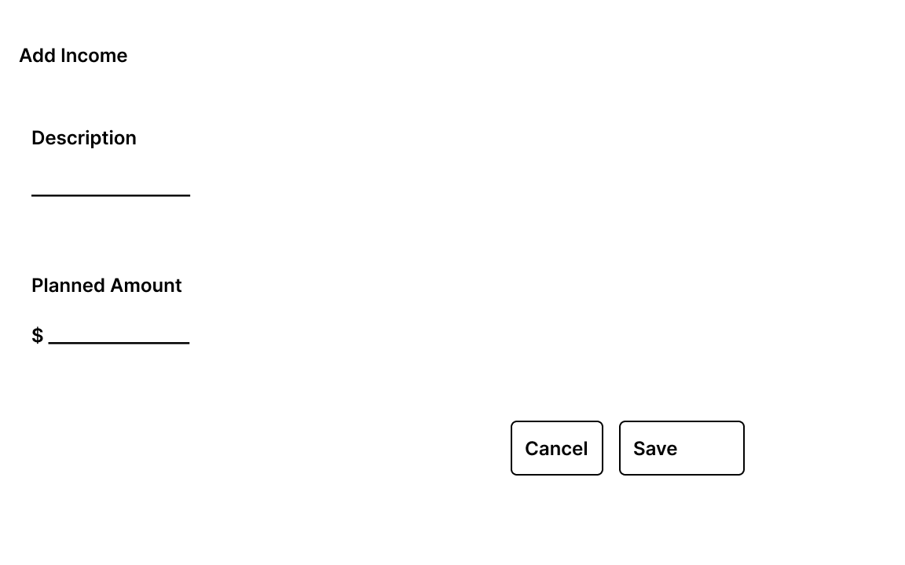

# Income Interactions

## Purpose

Define the user interactions related to income management within a Financial Period.

Income interactions allow the user to:

- Add planned income to an open financial period.
- Enter the actual amount of an existing income.
- Review planned and actual income information from the Financial Period Dashboard.

The wireframes included in this document are versioned visual references for the supported MVP interactions.

---

## Income Representation

Income is displayed as part of the Financial Period Dashboard.

Each income presents:

- Description.
- Planned amount.
- Actual amount.
- Contextual action when applicable.

Income operations are available only when allowed by the current financial period and income state.

---

# Add Income

## Purpose

The Add Income interaction allows the user to create a planned income within an open financial period.

The interaction is started from **Add Income** in the Income section of the Financial Period Dashboard.

## Input

The user provides:

- **Description**
- **Planned Amount**

The actual amount is not entered during income creation.

## Actions

### Save

When the user selects **Save**:

1. The entered information is validated.
2. The application attempts to add the income to the selected financial period.
3. If the operation succeeds, the modal is closed.
4. The updated financial period is retrieved.
5. The dashboard is refreshed.

The refreshed dashboard reflects the new income and any resulting changes to the financial summary.

### Cancel

**Cancel** closes the modal without creating an income or modifying the financial period.

## Wireframe

---

# Confirm Income

## Purpose

The Confirm Income interaction allows the user to enter the actual amount received for an existing income.

The interaction is started from the contextual **Confirm** action associated with an income.

## Information Presented

The modal identifies the selected income and displays:

- Income description.
- Planned amount.

## Input

The user provides:

- **Actual Amount**

The planned amount is presented as reference information and is not modified during confirmation.

## Actions

### Confirm

When the user selects **Confirm**:

1. The entered actual amount is validated.
2. The application attempts to enter the actual income.
3. If the operation succeeds, the modal is closed.
4. The updated financial period is retrieved.
5. The dashboard is refreshed.

The refreshed dashboard reflects the actual income and any resulting changes to the financial summary.

### Cancel

**Cancel** closes the modal without modifying the income or financial period.

## Wireframe

---

# Interaction States

## Successful Operation

After a successful Add or Confirm operation:

- The interaction modal is closed.
- The updated financial period is retrieved.
- The Income section is refreshed.
- The Financial Summary is refreshed.
- Available actions are updated according to the resulting state.

The user remains in the Financial Period Dashboard.

---

## Input Validation Error

If required or invalid input prevents the operation from being submitted:

- The modal remains open.
- The affected field is identified.
- A validation message is displayed near the corresponding field.
- Previously entered valid information is preserved.

No financial information is modified.

---

## Domain Rejection

If the submitted operation is rejected by a business rule:

- No financial information is modified.
- The user receives domain-level feedback.
- The dashboard remains in a consistent state.

Domain feedback follows the common interface feedback pattern defined in `interface-states.md`.

---

## Technical Failure

If the operation cannot be completed because of a technical failure:

- No successful modification is assumed.
- The user receives technical failure feedback.
- The current dashboard remains available.

Technical failure feedback follows the common interface feedback pattern defined in `interface-states.md`.

---

# Closed Financial Period

Income modification operations are not available when the selected financial period is closed.

Existing income information remains visible for consultation, but:

- New income cannot be added.
- Actual income cannot be confirmed.

Period navigation remains available.

---

## Design Source

The wireframes included in this document are versioned artifacts of the MVP interaction design.

The Markdown specification and the versioned wireframes together define the Income interaction reference for frontend implementation.

---

## Related Documents

- `financial-period-dashboard.md`
- `screen-map.md`
- `interface-states.md`
- `period-lifecycle-interactions.md`

Related functional flow:

- UF-002 — Monthly Financial Period Management.