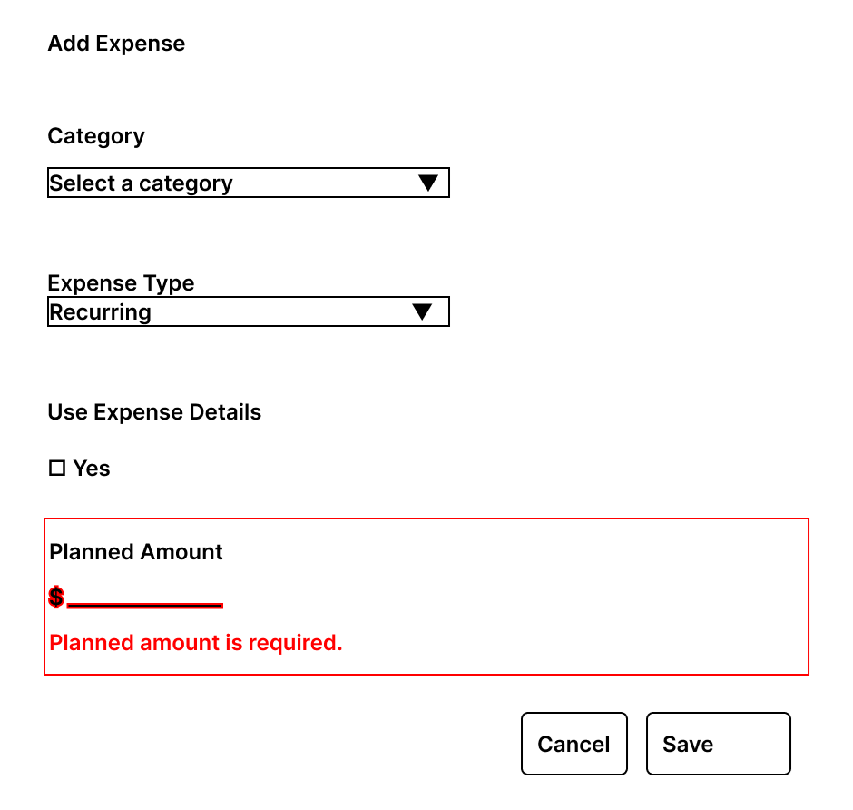
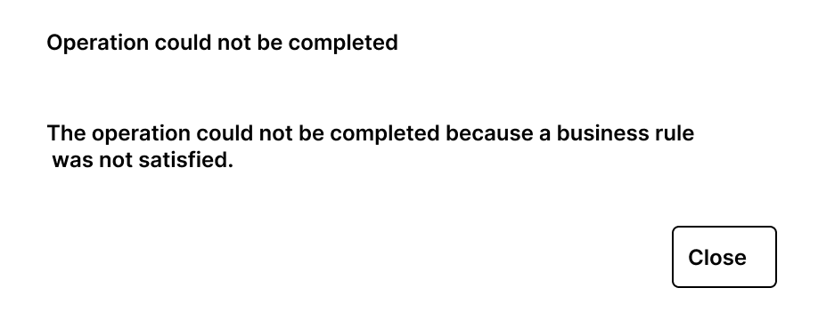
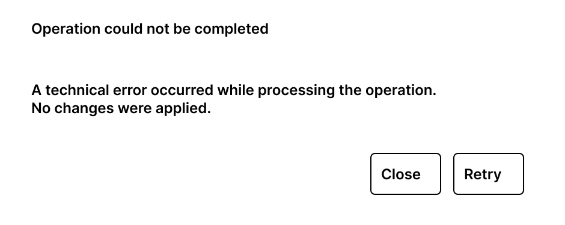

# Interface States and Feedback

## Purpose

Define the common interface states and feedback patterns used by the Financial Period experience.

These patterns provide consistent behavior for:

- Empty states.
- Input validation errors.
- Domain errors.
- Technical errors.

The goal is to communicate the result of an interaction without duplicating business rules in the user interface.

---

# Initial Loading State

## Purpose

The Initial Loading State represents the application state while Beridian determines which Financial Period must be displayed when the user enters the application.
This state is shown before the Financial Period Dashboard becomes available.

---

## Behavior

When the user opens Beridian:

1. The application determines the current month and year.
2. The application verifies the available financial history.
3. If required, the application restores Financial Period continuity.
4. The current Financial Period is retrieved.
5. The corresponding Financial Period Dashboard state is displayed.

Depending on the result, the user reaches:

- An empty current Financial Period.
- An existing open Financial Period.
- An existing closed Financial Period.
- A current Financial Period generated during synchronization.

The user does not manually participate in initialization or synchronization.

---

## Presentation

While initialization is in progress, the interface displays a simple loading state.
For the MVP, the state only needs to communicate that the Financial Period is being loaded.

Example:

```text
Beridian

Loading financial period...
```

No financial information or Financial Period actions should be displayed until the current period has been successfully determined.

---

## Failure Behavior

If initialization or synchronization is rejected by a business rule, the application follows the **Domain Error** feedback pattern.

If initialization, retrieval, or synchronization cannot be completed because of a technical failure, the application follows the **Technical Error** feedback pattern.

The application must not present an incomplete or unconfirmed Financial Period as available.

---

# Empty State

## Purpose

An empty state represents a valid Financial Period or section for which no financial information has been added yet.

An empty state is not an error.

The interface must clearly distinguish between:

- No information available yet.
- An operation that failed.
- An operation that is unavailable.

---

## Financial Period Empty State

A newly created Financial Period may initially contain no expenses, incomes, or investment.

The Financial Period Dashboard remains available and displays its normal structure.

The sections present appropriate empty-state messages:

- **Expenses** — no expenses have been added yet.
- **Incomes** — no incomes have been added yet.
- **Investment** — no investment is currently available.

Applicable creation actions remain available while the Financial Period is open.

The versioned wireframe for this state is documented in `financial-period-dashboard.md`.

---

# Input Validation Error

## Purpose

Input validation feedback communicates problems that can be identified from the information entered by the user before the requested operation can be successfully submitted.

Examples include:

- Missing required information.
- Invalid amount input.
- Invalid field format.

Input validation does not represent a domain or technical failure.

---

## Behavior

When input validation fails:

1. The active modal remains open.
2. The affected field is visually identified.
3. A validation message is displayed near the affected field.
4. Previously entered valid information is preserved.
5. No successful financial modification is assumed.

The user can correct the input and submit the operation again.

---

## Example

A missing planned amount can be presented as:

**Planned amount is required.**

The message describes the input problem without exposing implementation details.

---

## Wireframe



---

# Domain Error

## Purpose

A Domain Error communicates that the requested operation cannot be completed because the current financial state does not allow it.

The user input may be structurally valid, but the operation is rejected by a business rule.

The interface must communicate the rejection without reproducing the domain rule independently.

---

## Behavior

When an operation is rejected by the domain:

1. No successful modification is assumed.
2. The user receives a clear explanation that the operation could not be completed.
3. The existing Financial Period remains available.
4. The user can close the feedback and continue working with the current financial state.

The domain or application layer remains the source of truth for the underlying business rule.

---

## Presentation

The feedback modal uses:

**Title**

`Operation could not be completed`

**Message**

A user-oriented description of the reason the operation was rejected.

**Action**

`Close`

The interface should not expose exception names, stack traces, internal identifiers, or implementation details.

---

## Wireframe



---

# Technical Error

## Purpose

A Technical Error communicates that an operation could not be completed because of an infrastructure, communication, persistence, or unexpected technical failure.

A Technical Error must not be presented as a business-rule rejection.

---

## Behavior

When a technical failure occurs:

1. No successful modification is assumed.
2. The user receives technical failure feedback.
3. The currently displayed Financial Period remains available when possible.
4. The user can close the feedback.
5. The user may retry the operation when retry is appropriate.

The interface must not assume that a failed request changed the financial state.

---

## Presentation

The feedback modal uses:

**Title**

`Operation could not be completed`

**Message**

A user-oriented explanation indicating that the operation could not be completed and that no successful change is assumed.

**Actions**

- `Close`
- `Retry` when the operation can safely be attempted again.

Technical details intended for diagnostics must not be exposed directly to the user.

---

## Wireframe



---

# Feedback Classification

The interface distinguishes feedback according to where the problem is identified.

| Situation | Interface Response |
|---|---|
| Invalid or incomplete user input | Field-level validation feedback |
| Operation rejected by a business rule | Domain Error |
| Infrastructure or unexpected failure | Technical Error |

This separation prevents technical failures from being presented as user errors and prevents the frontend from independently implementing domain rules.

---

# Modal Preservation

When an error occurs while the user is working inside an interaction modal, the interface should preserve the user's context whenever possible.
For input validation:

- The current modal remains open.
- Entered values are preserved.

For domain or technical failures:

- The operation is not considered successful.
- The Financial Period remains in its last confirmed state.
- The user receives the corresponding feedback.

The frontend must only reflect a successful financial modification after the application confirms that the operation completed successfully.

---

# Closed Period State

A Closed Financial Period is an interface state but not an error state.

When a Financial Period is closed:

- Financial information remains visible.
- Modification actions are unavailable.
- Existing expense details remain available for consultation.
- Navigation remains available.
- Applicable lifecycle actions may remain available.

The complete Closed Financial Period behavior is documented in `financial-period-dashboard.md` and `period-lifecycle-interactions.md`.

---

## Design Source

The wireframes included in this document are versioned artifacts of the MVP feedback design.

The Markdown specification and the versioned wireframes together define the common interface-state and feedback reference for frontend implementation.

---

## Related Documents

- `screen-map.md`
- `financial-period-dashboard.md`
- `income-interactions.md`
- `expense-interactions.md`
- `investment-interactions.md`
- `period-lifecycle-interactions.md`

Related functional flows:

- UF-001 — Application Entry and Period Synchronization.
- UF-002 — Monthly Financial Period Management.
- UF-003 — Financial Period Closing.
- UF-004 — Financial Period Continuity.