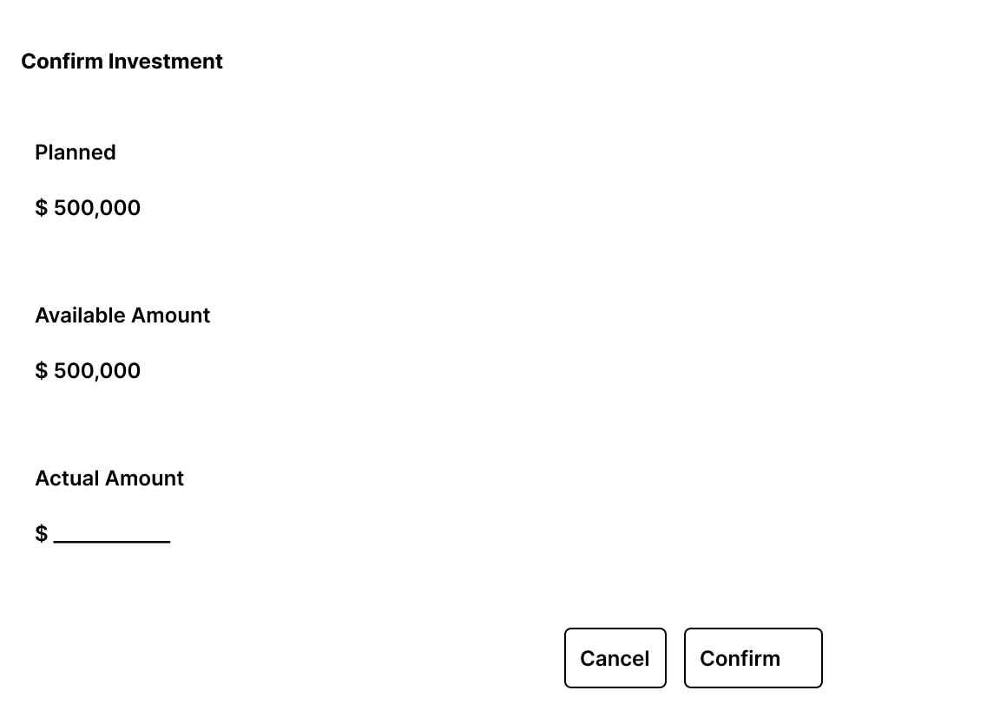

# Investment and Balance Interactions

## Purpose

Define the user interactions related to investment management and the presentation of financial balances within a Financial Period.

Investment interactions allow the user to:

- Review the planned investment for the selected financial period.
- Enter the actual investment amount when the operation is available.
- Review the financial effect of confirmed operations through the Financial Summary.

Balances are presented as financial information and do not provide direct editing operations.

The wireframe included in this document is the versioned visual reference for the supported MVP investment interaction.

---

## Investment Representation

Investment is displayed below the Expense and Income sections of the Financial Period Dashboard.

The section presents:

- Planned investment.
- Actual investment.
- Contextual confirmation action when available.

The dashboard presents investment information but does not independently calculate or redefine its business rules.

---

# Confirm Investment

## Purpose

The Confirm Investment interaction allows the user to enter the actual investment amount for the selected financial period.

The interaction is started from the contextual **Confirm** action in the Investment section.

## Information Presented

The modal displays:

- **Planned Amount**
- **Available Amount**

These values provide context for the investment confirmation and are not directly modified by the interaction.

## Input

The user provides:

- **Actual Amount**

## Actions

### Confirm

When the user selects **Confirm**:

1. The entered actual amount is validated.
2. The application attempts to confirm the investment.
3. If the operation succeeds, the modal is closed.
4. The updated financial period is retrieved.
5. The dashboard is refreshed.

The refreshed dashboard reflects:

- The confirmed actual investment.
- The updated actual remaining balance.
- Any resulting change in available actions.

### Cancel

**Cancel** closes the modal without modifying the investment or financial period.

## Wireframe

---

# Financial Balances

Financial balances are displayed in the Financial Summary.

The dashboard presents:

- **Opening / Transferred Balance**
- **Planned Remaining Balance**
- **Actual Remaining Balance**

These values are read-only from the user interface.

They reflect the financial state calculated from the information belonging to the selected Financial Period.

---

## Opening / Transferred Balance

The opening balance represents the balance available when the financial period begins.

When a period is generated from a previous period, the resulting transferred balance becomes the opening financial position of the generated period.

The value is displayed for consultation and cannot be edited directly from the dashboard.

---

## Planned Remaining Balance

The Planned Remaining Balance represents the expected financial position of the period based on its planned information.

It reflects:

- Opening / Transferred Balance.
- Planned income.
- Planned expenses.
- Planned investment.

The value is recalculated as the financial state of the period changes.

---

## Actual Remaining Balance

The Actual Remaining Balance represents the current financial position using confirmed financial information.

It reflects:

- Opening / Transferred Balance.
- Actual income.
- Actual expenses.
- Actual investment.

Successful financial confirmations can therefore change the Actual Remaining Balance displayed in the Financial Summary.

---

# Interaction States

## Successful Confirmation

After successful investment confirmation:

- The modal is closed.
- The updated financial period is retrieved.
- The Investment section is refreshed.
- The Financial Summary is refreshed.
- Available actions reflect the resulting state.

The user remains in the Financial Period Dashboard.

---

## Input Validation Error

If the actual amount contains invalid or incomplete input:

- The modal remains open.
- The affected field is identified.
- A validation message is displayed near the field.
- Previously entered valid information is preserved.

No successful financial modification is assumed.

---

## Domain Rejection

If the investment confirmation is rejected by a business rule:

- No successful financial modification is assumed.
- The user receives domain-level feedback.
- The dashboard remains in a consistent state.

Domain feedback follows the common interface feedback pattern defined in `interface-states.md`.

---

## Technical Failure

If the investment confirmation cannot be completed because of a technical failure:

- No successful modification is assumed.
- The user receives technical failure feedback.
- The current financial period remains available.

Technical failure feedback follows the common interface feedback pattern defined in `interface-states.md`.

---

# Closed Financial Period

Investment modification operations are not available when the selected financial period is closed.

The planned and actual investment amounts remain visible for consultation.

Financial balances also remain visible as part of the Financial Summary.

Period navigation remains available.

---

## Design Source

The wireframe included in this document is a versioned artifact of the MVP interaction design.

The Markdown specification and the versioned wireframe together define the Investment and Balance interaction reference for frontend implementation.

---

## Related Documents

- `financial-period-dashboard.md`
- `screen-map.md`
- `income-interactions.md`
- `expense-interactions.md`
- `interface-states.md`
- `period-lifecycle-interactions.md`

Related functional flows:

- UF-002 — Monthly Financial Period Management.
- UF-004 — Financial Period Continuity.