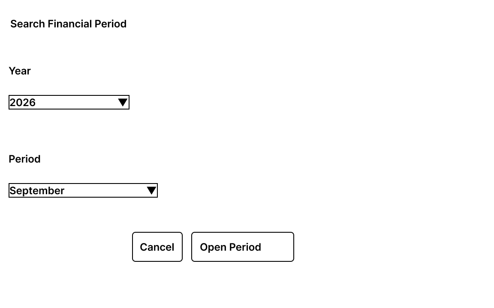
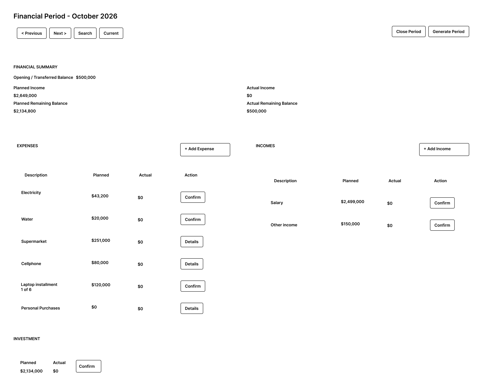

# Financial Period Lifecycle and Navigation

## Purpose

Define the user interactions related to Financial Period lifecycle operations and navigation between financial periods.

This document covers:

- Closing a Financial Period.
- Manually generating the next Financial Period.
- Navigating to previous and next periods.
- Searching for a specific Financial Period.
- Returning to the current Financial Period.

The wireframes included in this document are versioned visual references for the supported MVP interactions.

---

# Period Navigation

Financial Period navigation is available from the main dashboard header.

Navigation changes the Financial Period displayed by the application but does not modify financial information.

The supported navigation actions are:

- **Previous**
- **Next**
- **Search**
- **Current**

---

## Previous Period

**Previous** navigates to the previous available Financial Period.

After navigation:

1. The selected period is retrieved.
2. The Financial Period Dashboard displays its financial information.
3. Available actions reflect the state of the selected period.

Historical periods may therefore be displayed in open or closed state, depending on their current lifecycle state.

---

## Next Period

**Next** navigates to the next available Financial Period.

After navigation:

1. The selected period is retrieved.
2. The Financial Period Dashboard displays its financial information.
3. Available actions reflect the state of the selected period.

Navigation does not generate a missing Financial Period.

Period generation is a separate lifecycle operation.

---

## Current Period

**Current** returns directly to the Financial Period corresponding to the current month.

The action provides a direct way to return from historical navigation to the current financial context.

After navigation, the dashboard displays the retrieved current Financial Period and its corresponding state.

---

# Search Financial Period

## Purpose

The Search Financial Period interaction allows the user to select a specific Financial Period without navigating sequentially through previous or next periods.

The interaction is started from **Search** in the dashboard header.

## Input

The user selects:

- **Year**
- **Period**

## Actions

### Open Period

When the user selects **Open Period**:

1. The selected year and period are validated.
2. The requested Financial Period is retrieved.
3. The modal is closed.
4. The Financial Period Dashboard displays the selected period.
5. Available actions reflect the state of that period.

The operation only changes the Financial Period being displayed.

### Cancel

**Cancel** closes the modal without changing the currently displayed Financial Period.

## Wireframe

---

# Close Financial Period

## Purpose

The Close Financial Period interaction allows the user to explicitly close an open Financial Period.

Closing represents a lifecycle transition and is irreversible through the supported MVP interface.

## Interaction

The operation is started from **Close Period** in the dashboard header.

Before performing the operation, the application presents a confirmation modal containing:

- The Financial Period being closed.
- A final financial summary.
- A warning that the operation is irreversible.

The modal allows the user to review the period before confirming the transition.

## Actions

### Close Period

When the user selects **Close Period**:

1. The application attempts to close the selected Financial Period.
2. If the operation succeeds, the modal is closed.
3. The updated Financial Period is retrieved.
4. The same period remains displayed.
5. The dashboard changes to consultation mode.

After closing:

- The period status is displayed as **Closed**.
- Financial modification actions are unavailable.
- Existing financial information remains visible.
- Expense details remain available for consultation.
- Period navigation remains available.
- Generation of the following period may be available when applicable.

Closing the period does not automatically navigate to another Financial Period.

### Cancel

**Cancel** closes the confirmation modal without changing the Financial Period.

## Wireframe

---

# Generate Financial Period

## Purpose

The Generate Financial Period interaction allows the user to manually create the Financial Period immediately following the selected source period.

Manual generation provides an explicit alternative when the following period needs to be created by the user.

## Interaction

The operation is started from **Generate Period** when generation is available.

Before generating the period, the application presents a confirmation modal containing:

- **Current Period** — the source Financial Period.
- **Next Period** — the Financial Period that will be generated.
- A description of the operation.

## Actions

### Generate Period

When the user selects **Generate Period**:

1. The application verifies that the target Financial Period does not already exist.
2. The next Financial Period is generated according to the financial continuity rules.
3. The generated period is persisted.
4. The modal is closed.
5. The generated Financial Period is retrieved.
6. The Financial Period Dashboard displays the generated period.

The generated period becomes the active period displayed to the user.

The generation operation applies the carry-forward and reset rules defined by the Financial Period continuity flow and domain behavior.

The interface does not independently reproduce those rules.

### Cancel

**Cancel** closes the modal without generating a Financial Period.

## Wireframe

---

# Generated Period Behavior

A manually generated Financial Period uses the standard Financial Period Dashboard.

No separate screen is required.

After successful generation:

- The generated period is displayed.
- The period is open.
- Its financial information reflects the generation rules.
- Actual values begin according to the reset rules.
- Applicable financial operations become available.

---

# Existing Target Period

If the Financial Period that would be generated already exists, the application must not create a duplicate period.

The interface provides appropriate feedback and preserves the existing financial state.

No successful generation is assumed.

---

# Interaction States

## Successful Lifecycle Operation

After a successful lifecycle operation:

- The corresponding modal is closed.
- The relevant Financial Period is retrieved.
- The dashboard is refreshed.
- Available actions reflect the resulting lifecycle state.

The period displayed after the operation depends on the operation:

- **Close Period** keeps the closed source period displayed.
- **Generate Period** displays the newly generated period.

---

## Domain Rejection

If a lifecycle operation is rejected by a business rule:

- No successful lifecycle transition is assumed.
- The user receives domain-level feedback.
- The existing Financial Period remains available.

Domain feedback follows the common interface feedback pattern defined in `interface-states.md`.

---

## Technical Failure

If a lifecycle or navigation operation cannot be completed because of a technical failure:

- No successful state change is assumed.
- The user receives technical failure feedback.
- The current Financial Period remains available when possible.

Technical failure feedback follows the common interface feedback pattern defined in `interface-states.md`.

---

# Navigation and Lifecycle Separation

Navigation and lifecycle operations represent different responsibilities.

Navigation:

- Selects which existing Financial Period is displayed.
- Does not modify financial information.
- Does not create missing periods.

Lifecycle operations:

- Change the state or continuity of Financial Periods.
- Include closing an existing period.
- Include generating the immediately following period.

Keeping these responsibilities separate prevents navigation actions from implicitly modifying the financial model.

---

## Design Source

The wireframes included in this document are versioned artifacts of the MVP interaction design.

The Markdown specification and the versioned wireframes together define the Financial Period lifecycle and navigation reference for frontend implementation.

---

## Related Documents

- `financial-period-dashboard.md`
- `screen-map.md`
- `income-interactions.md`
- `expense-interactions.md`
- `investment-interactions.md`
- `interface-states.md`

Related functional flows:

- UF-001 — Application Entry and Period Synchronization.
- UF-002 — Monthly Financial Period Management.
- UF-003 — Financial Period Closing.
- UF-004 — Financial Period Continuity.