# Screen Map

## Purpose

Define the screens, dialogs, and navigation elements required to support the documented Beridian MVP user flows.

## MVP Scope

The MVP uses the Financial Period as its main interaction surface. Users access the current period, navigate historical periods, and reach financial operations from this screen or through contextual modals.

## Main Screen

### Financial Period States
- Open Financial Period
- Closed / Historical Financial Period
- Empty Financial Period
- Generated Financial Period

## Screen Map

The Financial Period is the main interaction surface of the Beridian MVP.
All financial operations are performed within this screen or through contextual modals.

The screen map and its interactions are represented in the following PlantUML diagram:

```plantuml
@startuml
title Beridian - Financial Period Screen Map

skinparam packageStyle rectangle
skinparam shadowing false

rectangle "Financial Period\nMain Screen" as FinancialPeriod {

    rectangle "Period Navigation" as Navigation
    rectangle "Income Section" as Income
    rectangle "Expense Section" as Expense
    rectangle "Investment Section" as Investment
    rectangle "Period Lifecycle" as Lifecycle
}

rectangle "Search Financial Period Modal" as SearchPeriodModal

rectangle "Add Income Modal" as AddIncomeModal
rectangle "Confirm Income Modal" as ConfirmIncomeModal

rectangle "Add Expense Modal" as AddExpenseModal
rectangle "Confirm Expense Modal" as ConfirmExpenseModal
rectangle "Expense Details Modal" as ExpenseDetailsModal
rectangle "Add Expense Detail Modal" as AddExpenseDetailModal
rectangle "Edit Expense Detail Modal" as EditExpenseDetailModal

rectangle "Confirm Investment Modal" as ConfirmInvestmentModal

rectangle "Close Financial Period Modal" as ClosePeriodModal
rectangle "Generate Financial Period Modal" as GeneratePeriodModal

FinancialPeriod --> Navigation
FinancialPeriod --> Income
FinancialPeriod --> Expense
FinancialPeriod --> Investment
FinancialPeriod --> Lifecycle

Navigation --> SearchPeriodModal : Search
Navigation --> FinancialPeriod : Previous / Next / Current

Income --> AddIncomeModal : Add Income
Income --> ConfirmIncomeModal : Confirm Income

Expense --> AddExpenseModal : Add Expense
Expense --> ConfirmExpenseModal : Confirm\nwithout details
Expense --> ExpenseDetailsModal : View / Edit / Confirm\ndetails

ExpenseDetailsModal --> AddExpenseDetailModal : Add Detail
ExpenseDetailsModal --> EditExpenseDetailModal : Edit Detail

Investment --> ConfirmInvestmentModal : Confirm Actual

Lifecycle --> ClosePeriodModal : Close Period
Lifecycle --> GeneratePeriodModal : Generate Period

ClosePeriodModal --> FinancialPeriod : Closed Period
GeneratePeriodModal --> FinancialPeriod : Generated Period

note right of FinancialPeriod
Main interaction surface for the MVP.

States:
- Open Period
- Closed / Historical Period
- Empty Period
- Generated Period

Closed periods are read-only.
end note

note right of Navigation
Previous / Next navigate through
available financial periods.

Search opens Search Financial Period Modal.
Current returns to the current financial period.
end note

note right of ExpenseDetailsModal
Used when the expense has details.

Actual Amount is derived from
the sum of the expense details.

Allows:
- View details
- Add details
- Edit details
- Confirm expense
end note

note right of ConfirmExpenseModal
Used when the expense
does not have details.

The user enters the Actual Amount
and confirms the expense.
end note

note right of Investment
Planned Investment is calculated
from the financial balance
and is read-only.

Only Actual Investment
is confirmed by the user.
end note

note right of ClosePeriodModal
Available for an open financial period.

Shows the final financial summary
and warns that the closed period
cannot receive further modifications.
end note

note right of GeneratePeriodModal
Manual generation creates the financial
period immediately following the
selected source period.

Scheduled generation and automatic
catch-up are handled without requiring
manual creation of each missing period.
end note

@enduml
```

## Interactions

### Period Navigation
### Income
### Expense
### Investment
### Period Lifecycle

## Modal Inventory

| Modal | Purpose | Trigger |
|------|---------|---------|
| Add Income | Add an income to the period | Add Income |
| Confirm Income | Enter actual income amount | Confirm |
| Add Expense | Add an expense | Add Expense |
| Confirm Expense | Enter actual amount for expense without details | Confirm |
| Expense Details | Manage and confirm expense details | Details |
| Add Expense Detail | Add a detail to an expense | Add Detail |
| Edit Expense Detail | Edit an existing expense detail | Edit |
| Confirm Investment | Enter actual investment amount | Confirm |
| Search Financial Period | Navigate directly to a specific period | Search |
| Close Financial Period | Review summary and close period | Close Period |
| Generate Financial Period | Manually generate the period following the selected period | Generate Period |

## Interaction Rules

- Closed periods are read-only.
- Previous/Next navigate through available financial periods.
- Search allows selecting a specific month and year.
- Current returns directly to the current financial period.
- Navigation does not modify financial information.
- Planned Investment is calculated and read-only.
- Close Period is available for an open financial period and requires confirmation.
- Manual period generation creates the period immediately following the selected source period.
- Input validation keeps the current dialog available so the user can correct invalid fields.
- Domain errors communicate the business-rule rejection without modifying the financial period.
- Technical errors preserve the last confirmed state and allow retry when appropriate.
